# Universidad Peruana de Ciencias Aplicadas

  

  **SI729 Desarrollo de Aplicaciones Open Source**  
    **Sección: WS53** 
    **Carrera: Ingeniería de Software** 
    **Ciclo: 5-6** 
    **Profesor:** 
    **Juan Antonio Flores Moroco** 
    **"Informe de Trabajo Final"** 
    **Tema: SphereHub** 
    **Producto: BookSphere** 
    **Agosto 2024** 

**Integrantes:**

- Gómez Vallejos Sergio André - U20221D401
- Salon Puerta Merly - U20201B772
- Romero Qwistgaard, Russell Stephen - U20211043
- Nanfuñay Liza, Pedro Jesús - U202215462
- Fabian Puente, Ronaldo Macedonio - U20201B193

  <strong>Registro de versiones de informe:</strong> 

| Entregables  | Fecha | Autor | Descripción de modificación |
|-----------|-----------|-----------|-----------|
| TB1| 03/09/2024 | Sergio André Gómez Vallejos | Implementación de contenido en el Student Outcome   Registrar las entrevistas  Desarrollo del Contenido II  Competidores  User Journey Mapping   Perfil de integrante   Desarrollar el Capitulo IV   Implementar en el Capitulo V, User Stories, Product Backlog, Landing Page, Capitulo II |
| TB1| 08/09/2024 | Russell Stephen Romero Qwistgaard | Lean UX   Análisis de entrevistas  To-Be Scenario Mapping   Web Applications User Flow Diagrams   Class Diagrams   Perfil de integrante   Registro de Entrevista |
| TB1| 08/09/2024 | Pedro Jesús Nanfuñay Liza | Perfil de integrante   Segmentos Objetivos   Entrevista Segmento 1   Análisis de entrevista   User Personas   Empathy Mapping   Class Dictionary   Landing Page UI Design   Web Applications UX/UI Design   Web Applications Wireflow Diagrams |
| TB1| 08/09/2024 | Merly Salon Puerta | Descripción de la StartUp   Antecedentes y problemática   Entrevista   Ubiquitous Language   User Stories   Impact Mapping   Information Architecture   Database diagram   Perfiles de integrantes del equipo |
| TP | Fila 2, Columna 2 | Fila 2, Columna 3 | Fila 2, Columna 4 |
| TB2 | Fila 3, Columna 2 | Fila 3, Columna 3 | Fila 3, Columna 4 |
| TF | Fila 4, Columna 2 | Fila 4, Columna 3 | Fila 4, Columna 4 |

**Project Report Collaboration Insights**

### URL del Repositorio 
https://github.com/orgs/BookSphere-SH/repositories

 # Tabla de contenido

1. [CAPÍTULO I: Introducción](#CAPÍTULO-I-Introducción) 
      1.1. [Startup Profile](#Startup-Profile) 
      1.1.1. [Descripción de la Startup](#Descripción-de-la-Startup) 
      1.1.2. [Perfiles de integrantes del equipo](#Perfiles-de-integrantes-del-equipo) 
   1.2. [Solution Profile](#Solution-Profile) 
      1.2.1. [Antecedentes y problemática](#Antecedentes-y-problemática) 
      1.2.2. [Lean UX Process](#Lean-UX-Process) 
             1.2.2.1 [Lean UX Problem Statements](#Lean-UX-Problem-Statements) 
             1.2.2.2 [Lean UX Assumptions](#Lean-US-Assumptions) 
             1.2.2.3 [Lean UX Hypothesis Statements](#Lean-UX-Hypothesis-Statements) 
             1.2.2.4 [Lean UX Canvas](#Lean-UX-Canvas)  
1.3. [Segmentos objetivo](#Segmentos-objetivo)  
2. [CAPÍTULO II: Requirements Elicitation & Analysis](#Capítulo-II-Requirements-Elicitation--Analysis)  
   2.1. [Competidores](#Competidores)  
      2.1.1. [Análisis competitivo](#Análisis-competitivo)  
      2.1.2. [Estrategias y tácticas frente a competidores](#Estrategias-y-tácticas-frente-a-competidores)  
   2.2. [Entrevistas](#Entrevistas)  
      2.2.1. [Diseño de entrevistas](#Diseño-de-entrevistas)  
      2.2.2. [Registro de entrevistas](#Registro-de-entrevistas)  
      2.2.3. [Análisis de entrevistas](#Análisis-de-entrevistas)  
   2.3. [Needfinding](#Needfinding)  
      2.3.1. [User Personas](#User-Personas)  
      2.3.2. [User Task Matrix](#User-Task-Matrix)  
      2.3.3. [User Journey Mapping](#User-Journey-Mapping)  
      2.3.4. [Empathy Mapping](#Empathy-Mapping)  
      2.3.5. [As-is Scenario Mapping](#As-is-Scenario-Mapping)  
   2.4. [Ubiquitous Language](#Ubiquitous-Language)  
3. [CAPÍTULO III: Requirements Specification](#Capítulo-III-Requirements-Specification)  
   3.1. [To-Be Scenario Mapping](#To-Be-Scenario-Mapping)  
   3.2. [User Stories](#User-Stories)  
   3.3. [Impact Mapping](#Impact-Mapping)  
   3.4. [Product Backlog](#Product-Backlog)  
4. [CAPÍTULO IV: Product Design](#Capítulo-IV-Product-Design)  
   4.1. [Style Guidelines](#Style-Guidelines)  
      4.1.1. [General Style Guidelines](#General-Style-Guidelines)  
      4.1.2. [Web Style Guidelines](#Web-Style-Guidelines)  
   4.2. [Information Architecture](#Information-Architecture)  
      4.2.1. [Organization Systems](#Organization-Systems)  
      4.2.2. [Labeling Systems](#Labeling-Systems)  
      4.2.3. [SEO Tags and Meta Tags](#SEO-Tags-and-Meta-Tags)  
      4.2.4. [Searching Systems](#Searching-Systems)  
      4.2.5. [Navigation Systems](#Navigation-Systems)  
   4.3. [Landing Page UI Design](#Landing-Page-UI-Design)  
      4.3.1. [Landing Page Wireframe](#Landing-Page-Wireframe)  
      4.3.2. [Landing Page Mock-up](#Landing-Page-Mock-up)  
   4.4. [Web Applications UX/UI Design](#Web-Applications-UX-UI-Design)  
      4.4.1. [Web Applications Wireframes](#Web-Applications-Wireframes)  
      4.4.2. [Web Applications Wireflow Diagrams](#Web-Applications-Wireflow-Diagrams)  
      4.4.3. [Web Applications Mock-ups](#Web-Applications-Mock-ups)  
      4.4.4. [Web Applications User Flow Diagrams](#Web-Applications-User-Flow-Diagrams)  
   4.5. [Web Applications Prototyping](#Web-Applications-Prototyping)  
   4.6. [Domain-Driven Software Architecture](#Domain-Driven-Software-Architecture)  
      4.6.1. [Software Architecture Context Diagram](#Software-Architecture-Context-Diagram)  
      4.6.2. [Software Architecture Container Diagrams](#Software-Architecture-Container-Diagrams)  
      4.6.3. [Software Architecture Components Diagrams](#Software-Architecture-Components-Diagrams)  
   4.7. [Software Object-Oriented Design](#Software-Object-Oriented-Design)  
      4.7.1. [Class Diagrams](#Class-Diagrams)  
      4.7.2. [Class Dictionary](#Class-Dictionary)  
   4.8. [Database Design](#Database-Design)  
      4.8.1. [Database Diagram](#Database-Diagram)  
5. [CAPÍTULO V: Product Implementation, Validation & Deployment](#Capítulo-V-Product-Implementation-Validation-Deployment)  
   5.1. [Software Configuration Management](#Software-Configuration-Management)  
      5.1.1. [Software Development Environment Configuration](#Software-Development-Environment-Configuration)  
      5.1.2. [Source Code Management](#Source-Code-Management)  
      5.1.3. [Source Code Style Guide & Conventions](#Source-Code-Style-Guide-Conventions)  
      5.1.4. [Software Deployment Configuration](#Software-Deployment-Configuration)  
   5.2. [Landing Page, Services & Applications Implementation](#Landing-Page-Services-Applications-Implementation)  
      5.2.1. [Sprint 1](#Sprint-1)  
         5.2.1.1. [Sprint Planning 1](#Sprint-Planning-1)  
         5.2.1.2. [Sprint Backlog 1](#Sprint-Backlog-1)  
         5.2.1.3. [Development Evidence for Sprint Review](#Development-Evidence-for-Sprint-Review)  
         5.2.1.4. [Testing Suite Evidence for Sprint Review](#Testing-Suite-Evidence-for-Sprint-Review)  
         5.2.1.5. [Execution Evidence for Sprint Review](#Execution-Evidence-for-Sprint-Review)  
         5.2.1.6. [Services Documentation Evidence for Sprint Review](#Services-Documentation-Evidence-for-Sprint-Review)  
         5.2.1.7. [Software Deployment Evidence for Sprint Review](#Software-Deployment-Evidence-for-Sprint-Review)  
         5.2.1.8. [Team Collaboration Insights during Sprint](#Team-Collaboration-Insights-during-Sprint)  
      5.2.2. [Sprint 2](#Sprint-2)  
         5.2.2.1. [Sprint Planning 2](#Sprint-Planning-2)  
         5.2.2.2. [Sprint Backlog 2](#Sprint-Backlog-2)  
         5.2.2.3. [Development Evidence for Sprint Review](#Development-Evidence-for-Sprint-Review-2)  
         5.2.2.4. [Testing Suite Evidence for Sprint Review](#Testing-Suite-Evidence-for-Sprint-Review-2)  
         5.2.2.5. [Execution Evidence for Sprint Review](#Execution-Evidence-for-Sprint-Review-2)  
         5.2.2.6. [Services Documentation Evidence for Sprint Review](#Services-Documentation-Evidence-for-Sprint-Review-2)  
         5.2.2.7. [Software Deployment Evidence for Sprint Review](#Software-Deployment-Evidence-for-Sprint-Review-2)  
         5.2.2.8. [Team Collaboration Insights during Sprint](#Team-Collaboration-Insights-during-Sprint-2)  
      5.2.3. [Sprint 3](#Sprint-3)  
         5.2.3.1. [Sprint Planning 3](#Sprint-Planning-3)  
         5.2.3.2. [Sprint Backlog 3](#Sprint-Backlog-3)  
         5.2.3.3. [Development Evidence for Sprint Review](#Development-Evidence-for-Sprint-Review-3)  
         5.2.3.4. [Testing Suite Evidence for Sprint Review](#Testing-Suite-Evidence-for-Sprint-Review-3)  
         5.2.3.5. [Execution Evidence for Sprint Review](#Execution-Evidence-for-Sprint-Review-3)  
         5.2.3.6. [Services Documentation Evidence for Sprint Review](#Services-Documentation-Evidence-for-Sprint-Review-3)  
         5.2.3.7. [Software Deployment Evidence for Sprint Review](#Software-Deployment-Evidence-for-Sprint-Review-3)  
         5.2.3.8. [Team Collaboration Insights during Sprint](#Team-Collaboration-Insights-during-Sprint-3)  
      5.2.4. [Sprint 4](#Sprint-4)  
         5.2.4.1. [Sprint Planning 4](#Sprint-Planning-4)  
         5.2.4.2. [Sprint Backlog 4](#Sprint-Backlog-4)  
         5.2.4.3. [Development Evidence for Sprint Review](#Development-Evidence-for-Sprint-Review-4)  
         5.2.4.4. [Testing Suite Evidence for Sprint Review](#Testing-Suite-Evidence-for-Sprint-Review-4)  
         5.2.4.5. [Execution Evidence for Sprint Review](#Execution-Evidence-for-Sprint-Review-4)  
         5.2.4.6. [Services Documentation Evidence for Sprint Review](#Services-Documentation-Evidence-for-Sprint-Review-4)  
         5.2.4.7. [Software Deployment Evidence for Sprint Review](#Software-Deployment-Evidence-for-Sprint-Review-4)  
         5.2.4.8. [Team Collaboration Insights during Sprint](#Team-Collaboration-Insights-during-Sprint-4)  
   5.3. [Validation & Testing](#Validation-Testing)  
      5.3.1. [Testing Plan](#Testing-Plan)  
      5.3.2. [Quality Assurance](#Quality-Assurance)  
      5.3.3. [User Acceptance Testing (UAT)](#User-Acceptance-Testing-UAT)  
   5.4. [Product Deployment](#Product-Deployment)  
      5.4.1. [Deployment Plan](#Deployment-Plan)  
      5.4.2. [Deployment Process](#Deployment-Process)  
      5.4.3. [Post-Deployment Review](#Post-Deployment-Review)  
      
[Conclusiones](#Conclusiones)  
[Conclusiones y recomendaciones](#Conclusiones-y-recomendaciones)  
[Video About-the-Team](#Video-About-the-Team)  
[Bibliografía](#Bibliografía)  
[Anexos](#Anexos)  
  
 
# STUDENT OUTCOME
El curso contribuye al cumplimiento del Student Outcome ABET: 
##### ABET – EAC - Student Outcome 3 
Criterio: Capacidad de comunicarse efectivamente con un rango de audiencias. En el siguiente cuadro se describe las acciones realizadas y enunciados de conclusiones por parte del grupo, que permiten sustentar el haber alcanzado el logro del ABET – EAC - Student Outcome 3. 

| **Criterio específico** | **Acciones realizadas** | **Conclusiones** |
|-------------------------|------------------------|------------------|
| Comunica oralmente con efectividad a diferentes rangos de audiencia. | 1.- Sergio André Gómez Vallejos: TB1: Presenté de manera clara y adaptada los avances y resultados del proyecto, asegurándome de que todos los miembros del equipo y las audiencias externas comprendieran los aspectos técnicos y estratégicos, lo que facilitó la toma de decisiones informadas.   2.- Pedro Jesús Nanfuñay Liza: TB1: Cumplí de manera satisfactoria el avance de los items que se me han asignado, demostrando responsabilidad y compromiso con la realización del proyecto y siempre dispuesto a apoyar a mis compañeros de equipo.   3.- Merly Salon Puerta. TB1: Mantuve comunicación activa con los integrantes del equipo para la distribución equitativa del trabajo. Así mismo, desarrolé las actividades que me tocaron realizar manteniendo una comunicación activa con los responsables de las demás tareas.|  Se demostró una notable capacidad para presentar los avances y resultados del proyecto de manera clara y adaptada a las necesidades de diversos grupos. Su habilidad para comunicar aspectos técnicos y estratégicos de manera comprensible permitió a los miembros del equipo y a las audiencias externas tomar decisiones informadas, evidenciando una comunicación oral efectiva con diferentes rangos de audiencia.                |
| Comunica por escrito con efectividad a diferentes rangos de audiencia. | 1.- Sergio André Gómez Vallejos: TB1: Redacté el informme sobre el proyecto, ajustando el lenguaje y la estructura para que fueran accesibles tanto para compañeros técnicos como para audiencias no técnicas, garantizando la comprensión y utilidad de la información compartida.   2.- Pedro Jesús Nanfuñay Liza: TB1: Redacté el avance de los items del presente proyecto manera satisfactoria, garantizando la fácil lectura para los usuarios, de esta manera se logra una mejor exposición de la información.   3.- Merly Salon Puerta. TB1: Realicé las actividades que me tocó desarrollar de manera clara, procurando una correcta presentación al docente y a mis compañeros. |  Se mostró competencia en la redacción del informe del proyecto, ajustando el lenguaje y la estructura del documento para que fuera accesible tanto para compañeros técnicos como para audiencias no técnicas. Su enfoque en garantizar la comprensión y utilidad de la información compartida refleja una habilidad efectiva para comunicar por escrito a diferentes rangos de audiencia.                |

# 1. CAPÍTULO I: Introducción
## 1.1. Startup Profile
### 1.1.1. Descripción de la Startup
#### 1.1.2. Descripción General:

SphereHub es nuestra empresa innovadora que une la pasión por la lectura y la tecnología con el objetivo de transformar la manera en que las personas acceden a los libros y materiales educativos. Al igual que Steam revolucionó la distribución de videojuegos, BookSphere nuestro producto, busca convertirse en la plataforma de referencia para el acceso y la exploración de libros, audiolibros, y recursos de estudio en formato digital.

Nuestra plataforma principal, BookSphere, permite a los usuarios explorar una vasta colección de libros y audiolibros, acceder a reseñas, y visualizar información detallada antes de decidir qué leer. BookSphere no solo es un lugar para descubrir nuevos títulos, sino también para sumergirse en el contenido de una manera interactiva y personalizada.

#### Colaboraciones Estratégicas:
En BookSphere, estamos comprometidos a establecer sólidas alianzas con editoriales, autores independientes, e instituciones educativas. Trabajamos en estrecha colaboración con ellos para garantizar que nuestros usuarios tengan acceso a una biblioteca digital en constante expansión, donde se destacan tanto las obras clásicas como las contemporáneas. Invitamos a los autores y las editoriales a cargar versiones digitales de sus libros y otros materiales educativos, enriqueciendo nuestra plataforma y ampliando las opciones disponibles para los lectores.

#### Innovación y Tecnología:
Nuestra plataforma utiliza tecnologías avanzadas para ofrecer una experiencia inmersiva a los usuarios. Desde la capacidad de visualizar adelantos y reseñas en formato interactivo hasta la personalización del contenido basado en los intereses del usuario, BookSphere busca redefinir la forma en que las personas interactúan con los libros y el conocimiento. Queremos que cada usuario se sienta como un explorador en un vasto universo literario, con acceso inmediato a los recursos que necesita para aprender, crecer y disfrutar.

#### Comunidad y Funciones Sociales:
BookSphere no es solo una plataforma para leer y aprender; es también un espacio social donde los usuarios pueden conectarse con otros lectores, compartir opiniones, y descubrir nuevas perspectivas. La plataforma incluye funciones de red social que permiten a los usuarios dejar comentarios y reseñas, participar en discusiones sobre libros, y seguir a otros miembros de la comunidad con intereses similares. Esta característica fomenta la creación de una comunidad vibrante y comprometida, donde los lectores pueden intercambiar ideas y recomendaciones, creando un ambiente enriquecedor y colaborativo.

#### Visión:
Visualizamos un mundo donde la tecnología y la lectura se fusionan para crear experiencias enriquecedoras y accesibles para todos. Nuestro objetivo es que BookSphere sea sinónimo de innovación en el mundo de la literatura y la educación, un lugar donde los usuarios puedan descubrir y disfrutar de libros y materiales educativos de manera más intuitiva y conectada. Aspiramos a crear una sociedad donde el conocimiento esté al alcance de todos, y donde el acceso a los recursos educativos sea tan sencillo y emocionante como explorar una biblioteca infinita.

#### Misión:
Nos esforzamos por proporcionar una plataforma que conecte a los lectores y estudiantes con una vasta colección de recursos educativos a través de una experiencia digital avanzada. Estamos decididos a utilizar la tecnología para generar un impacto positivo en el acceso al conocimiento y la educación. BookSphere será símbolo de pasión por la lectura, innovación en la distribución de libros, y compromiso con el aprendizaje continuo, mientras fomentamos una comunidad activa y participativa en torno a la literatura y el conocimiento.

### 1.1.2. Perfiles de integrantes del equipo
| Integrante | Descripción |
| ---- | --- |
|  | Sergio André Gómez Vallejos – Ingeniería de Software – u20221d401   Soy una persona resiliente que, sin importar cuántas veces caiga, siempre encuentra la manera de levantarse. Tengo habilidades sociales sólidas y una amplia experiencia en la resolución de problemas de código. Suelo ser el miembro más activo de mi equipo de trabajo. Me apasionan los lenguajes de programación y la tecnología, y constantemente me esfuerzo por alcanzar mis objetivos y contribuir al desarrollo del startup. |
|  | Merly Salon Puerta – Ingeniería de Software – U20201b772  A lo largo de mi vida he adquirido diversos valores éticos los cuales son la base en todas las áreas de mi vida. Estoy comprometida a aportar de diversas formas para el desarrollo del proyecto con mucho optimismo y entusiasmo. Participaré activamente en las actividades grupales para culminar el proyecto de manera satisfactoria. |
|  | Pedro Jesús Nanfuñay Liza - Ingeniería de Software - U202215462 Me considero una persona responsable y perseverante, siempre dispuesto a participar y colaborar con mi equipo. Cuento con conocimientos en varios lenguajes de programación y una fuerte pasión por investigar y conocer el desarrollo de las nuevas tecnologías. Mi objetivo es culminar este proyecto de manera satisfacoria.|
| | Russell Stephen Romero Qwistgaard - Ingeniería de Software - U202211043   Tengo 19 y estudió la carrera de ingeniería de software, actualmente en el 5 ciclo de esta. Me apasiona crear programas en entornos distintos para poder ampliar mi conocimiento en las muchas áreas que dependen de mi formación. Estoy dispuesto a cooperar y ser puntual en mis trabajos individuales y grupales. |
||Ronaldo Macedonio Fabian Puente - Ingeniería de Software - U20201b193 Me comprometo a desarrollar el trabajo en equipo hasta completar los objetivos planteados.|
## 1.2. Solution Profile
### 1.2.1. Antecedentes y problemática
### Antecedentes y problemática del producto

**Descripción de la problemática:**

El proyecto se enfoca en el desarrollo de una plataforma digital integral para estudiantes y autores que enfrenten dificultades para acceder a recursos educativos completos o distribuir contenido literario de manera efectiva. El problema radica en la falta de una plataforma centralizada y accesible que combine una amplia gama de libros y recursos educativos con características interactivas. Actualmente, las soluciones existentes son fragmentadas y no ofrecen una experiencia personalizada que responda adecuadamente a las necesidades de los usuarios.

**Objetivos:**

El principal objetivo de esta plataforma es cubrir la necesidad de acceso fácil y asequible a recursos educativos y literarios, creando un espacio donde los usuarios puedan interactuar, acceder a una amplia gama de contenidos y personalizar su experiencia. A largo plazo, el objetivo general es convertir esta plataforma en una referencia dentro del sector educativo digital, siendo económicamente sostenible.

**Restricciones:**

Un desafío significativo es que el equipo desarrollador tiene experiencia limitada en la creación de plataformas educativas a gran escala, lo que podría ralentizar el proceso de desarrollo y afectar la calidad de los primeros entregables. Sin embargo, se pondrá el máximo esfuerzo para cumplir con los objetivos propuestos.

---

### Herramienta 5W y 2H

**What - ¿Cuál es el problema?**  
El problema identificado es la falta de una plataforma digital centralizada y accesible para estudiantes y autores. Las plataformas actuales son fragmentadas, lo que dificulta el acceso a recursos educativos y literarios completos.

**When - ¿Cuándo sucede el problema?**  
Este problema es más agudo en la actualidad, en un contexto donde la digitalización está revolucionando la educación y el acceso a contenido literario, lo que hace que el momento actual sea crucial para resolver esta deficiencia.

**Where - ¿Dónde surge el problema?**  
El problema tiene un alcance global, pero es más grave en regiones con infraestructura digital deficiente o limitaciones económicas y tecnológicas que restringen el acceso a estos recursos.

**Who - ¿Quiénes son afectados por el problema?**  
Los principales afectados son los estudiantes, que tienen dificultades para acceder a recursos educativos, y los autores, que no encuentran plataformas efectivas para distribuir sus trabajos y conectar con sus lectores.

**Why - ¿Cuál es la causa del problema?**  
La causa es la ausencia de una plataforma digital completa y accesible que combine recursos educativos y literarios con características interactivas y personalizadas, lo que perpetúa las barreras en el acceso a estos contenidos.

**How - ¿Cómo se llevan a cabo los hechos?**  
Las plataformas existentes están enfocadas principalmente en la venta de libros sin ofrecer una experiencia integrada o personalizada para los usuarios, lo que genera una brecha en el acceso a los recursos.

**How much - ¿Cuál es la magnitud del problema?**  
El impacto se manifiesta en oportunidades educativas perdidas y en la ineficiencia al buscar recursos dispersos, lo que también dificulta la creación de comunidades para compartir y discutir conocimientos.

### 1.2.2. Lean UX Process

#### 1.2.2.1. Lean UX Problem Statements

1. El mercado de libros en línea no ha logrado una adecuada centralización ni expansión en los últimos años, lo que ha limitado la efectividad de las plataformas actuales para construir una comunidad activa. Esto ha provocado una desconexión tanto entre los consumidores, que muestran poco interés en utilizar estas plataformas de manera seguida, como entre los autores, que se sienten desincentivados para publicar sus obras en este entorno.

2. Autores sin recursos que intentan publicar sus trabajos enfrentan dificultades significativas, ya que a menudo necesitan contratar a un publisher para anunciar sus obras a gran escala. Este proceso no es accesible para todos, limitando la capacidad de los autores para llegar a una audiencia más amplia y obtener reconocimiento.

3. Las plataformas existentes a menudo carecen de herramientas efectivas para la promoción y visibilidad de nuevas obras, lo que restringe la capacidad de los autores para alcanzar su audiencia objetivo y obtener el reconocimiento necesario para el éxito de sus publicaciones.

4. Los lectores frecuentemente enfrentan dificultades para descubrir nuevos títulos que se alineen con sus intereses específicos debido a la falta de recomendaciones personalizadas y sistemas de filtrado efectivos en las plataformas actuales. Esto disminuye la capacidad de los lectores para encontrar contenido relevante y satisfactorio.

5. La gestión de derechos de autor y licencias sigue siendo un proceso complejo y opaco para muchos autores, lo que dificulta la protección adecuada de sus obras y limita la maximización de sus ingresos por derechos.

6. Las plataformas actuales de libros digitales no siempre ofrecen una experiencia de usuario coherente y fluida. Esto puede resultar en una navegación confusa y en una baja retención de usuarios, afectando la satisfacción general y la lealtad a la plataforma.

7. La interacción entre autores y lectores es limitada en las plataformas existentes, lo que impide la creación de una comunidad comprometida y la retroalimentación valiosa que podría mejorar continuamente las obras y la experiencia de lectura.

8. Los autores independientes a menudo tienen dificultades para acceder a datos analíticos detallados sobre el rendimiento de sus publicaciones, lo que les impide tomar decisiones informadas sobre estrategias de marketing y ajustes de contenido.

9. Muchas plataformas de libros digitales no proporcionan suficientes recursos y soporte para ayudar a los autores a mejorar sus habilidades de auto-publicación y marketing, dejándolos en desventaja frente a los autores establecidos que cuentan con apoyo editorial.

#### 1.2.2.2. Lean UX Assumptions

1. Si se desarrolla una solución, debe estar cuidadosamente modelada para adaptarse a los gustos y necesidades del público objetivo, y requerirá un mantenimiento continuo para asegurar una experiencia de usuario positiva y sin problemas. La solución debe ser diseñada con una comprensión clara de los problemas actuales y ser flexible para adaptarse a los cambios en las necesidades del usuario.

2. Los componentes de la solución deben centrarse en los objetivos principales y no desviarse hacia funcionalidades secundarias que no aporten valor directo al usuario o a la plataforma. La funcionalidad principal debe estar alineada con las necesidades expresadas en los Problem Statements.

3. La plataforma debe ofrecer una interfaz intuitiva y fácil de usar tanto para autores como para lectores, permitiendo una integración fluida de nuevas funcionalidades y asegurando que todos los usuarios puedan navegar y utilizar la plataforma con facilidad. La experiencia del usuario debe ser una prioridad para mantener la retención y satisfacción.

4. La solución debe facilitar la colaboración efectiva entre autores y lectores, promoviendo la creación de una comunidad activa y participativa que mejore la experiencia global y el compromiso con la plataforma. La interacción y el feedback deben ser parte integral de la plataforma.

5. La implementación de herramientas analíticas avanzadas debe ser una característica clave de la solución para proporcionar a los autores datos detallados sobre el rendimiento de sus publicaciones y facilitar la toma de decisiones informadas. Estas herramientas deben ser accesibles y útiles para maximizar su impacto.

#### 1.2.2.3. Lean UX Hypothesis Statements

1. **Hipótesis 1**: Creemos que, para abordar la desconexión entre consumidores y plataformas de libros en línea, es necesario desarrollar una aplicación que combine funcionalidades de venta de libros con características innovadoras como la personalización de contenido basada en intereses del usuario y funciones sociales interactivas. Esto resultará en un aumento del interés y la participación de los usuarios, así como en una mayor retención y satisfacción a largo plazo. 

   - **Business Outcome**: Aumento en el número de usuarios activos y comprometidos.
   - **Users**: Lectores interesados en una experiencia personalizada y social.
   - **User Outcome**: Mayor satisfacción y retención de usuarios debido a la relevancia del contenido y la interacción social.
   - **Feature**: Sistema de recomendaciones personalizadas y funciones de interacción social.

2. **Hipótesis 2**: También consideramos que es esencial crear una herramienta que respalde las necesidades de los autores, ofreciendo soporte integral para la auto-publicación y promoción, y proporcionando una plataforma que permita una gestión eficiente de derechos y licencias. Esto mejorará la capacidad de los autores para alcanzar y conectar con su audiencia, facilitando su éxito y maximización de ingresos.

   - **Business Outcome**: Mejora en la tasa de éxito de publicaciones y satisfacción de autores.
   - **Users**: Autores que buscan herramientas de auto-publicación y gestión de derechos.
   - **User Outcome**: Mayor facilidad en la publicación y promoción de obras, junto con una mejor gestión de derechos.
   - **Feature**: Herramientas de auto-publicación, promoción y gestión de derechos.

3. **Hipótesis 3**: Suponemos que al ofrecer una plataforma que simplifique la publicación y distribución para autores independientes y que permita una interacción significativa con los lectores, se incrementará el interés y la participación en el mercado de libros digitales. Esta integración ayudará a construir una comunidad más activa y comprometida.

   - **Business Outcome**: Expansión del mercado de libros digitales y aumento en la participación de autores y lectores.
   - **Users**: Autores independientes y lectores interesados en la interacción.
   - **User Outcome**: Mejor acceso y visibilidad para autores, mayor participación y comunidad para lectores.
   - **Feature**: Plataforma de publicación simplificada y funciones de interacción entre autores y lectores.

4. **Hipótesis 4**: Asumimos que la integración de funcionalidades que promuevan la colaboración entre autores y lectores, así como la inclusión de herramientas analíticas detalladas para evaluar el impacto y el rendimiento de las publicaciones, contribuirá al éxito y sostenibilidad de la plataforma. Esto mejorará la experiencia global y permitirá a los autores tomar decisiones informadas.

   - **Business Outcome**: Sostenibilidad y éxito continuado de la plataforma.
   - **Users**: Autores y lectores que buscan colaborar y obtener información detallada.
   - **User Outcome**: Mejora en la toma de decisiones basada en datos y mayor colaboración.
   - **Feature**: Herramientas de colaboración y análisis detallado del rendimiento.

#### 1.2.2.4. Lean UX Canvas
 
### 1.3. Segmentos objetivo
#### 1. Estudiantes:

Este segmento objetivo abarca estudiantes que buscan acceder a una amplia variedad de libros y audiolibros, ya sea por interés personal o para cumplir con sus obligaciones académicas. Estos usuarios valoran la accesibilidad, la diversidad de títulos, y la posibilidad de personalizar su experiencia de lectura. Además, están interesados en interactuar con otros lectores a través de reseñas y comunidades en línea que enriquecen su experiencia literaria.

#### 2. Autores:
El segundo segmento objetivo incluye a autores independientes que desean distribuir sus obras o recursos educativos de manera más eficiente y llegar a un público más amplio. Estos autores valoran una plataforma que les permita gestionar sus contenidos de forma digital y mantener un control sobre su distribución, con la posibilidad de obtener ingresos a través de suscripciones o ventas directas. Además, les interesa participar en una comunidad donde puedan interactuar con lectores, recibir feedback, y promover sus obras.

####  Variable geográfica:

País: Perú
Ciudad: Zonas urbanas y suburbanas

#### Variable demográfica:

Género: Femenino / Masculino
Ocupación: Estudiantes, lectores, editores, autores independientes
Estado civil: Todos los estados
Edad y etapa del ciclo de vida: Ciudadanos mayores de 15 años

#### Variable psicográfica:

Nivel Socioeconómico (NSE): Todos los niveles socioeconomicos
Características de personalidad: Curiosidad, deseo de aprendizaje continuo, aprecio por la lectura, compromiso con la educación y el desarrollo personal.

# 1. Capítulo II: Requirements Elicitation & Analysis
## 2.1. Competidores
BookSphere enfrenta competencia de plataformas como Google Play Books, Audible y Scribd. Google Play Books proporciona una amplia gama de libros electrónicos y audiolibros, pero carece de una componente social. Audible, especializado en audiolibros, ofrece una gran biblioteca y buena integración con dispositivos Amazon, aunque no cuenta con funciones comunitarias. Scribd ofrece acceso ilimitado a diversos contenidos digitales bajo suscripción, pero su interacción social es limitada. A diferencia de estos competidores, BookSphere destaca por integrar una comunidad literaria activa, permitiendo a los usuarios compartir reseñas y participar en discusiones, lo que enriquece la experiencia del usuario.
## 2.1.1. Análisis Competitivo
<table border="1" cellpadding="5" cellspacing="0">
   <tr>
      <td align="center" colspan="6"><strong>Análisis Competitivo</strong></td>
   </tr>
   <tr>
      <td colspan="2"><strong>¿Por qué llevar a cabo este análisis?</strong></td>
      <td colspan="4"><strong>¿Cómo podemos proporcionar un buen servicio entre los restaurantes y los consumidores de manera que la comunicación entre ambos sea efectiva y agradable?</strong></td>
   </tr>
   <tr>
      <td colspan="2"></td>
      <td align="center"><strong>SphereHub</strong> </td>
      <td align="center"><strong>Google Play Books</strong> </td>
      <td align="center"><strong>Audible</strong> </td>
      <td align="center"><strong>Scribd</strong> </td>
   </tr>
   <tr>
      <td rowspan="2"><strong>Perfil</strong></td>
      <td><strong>Overview</strong></td>
      <td>SphereHub es una empresa emergente que, a través de BookSphere, busca revolucionar el acceso a libros y recursos educativos digitales. Integrando una experiencia inmersiva y social, BookSphere se posiciona como una plataforma integral para estudiantes y lectores que desean descubrir, interactuar y compartir conocimientos.</td>
      <td>Google Play Books ofrece un extenso catálogo de libros digitales y audiolibros, con opciones de compra y alquiler directamente en la plataforma de Google.</td>
      <td>Audible, una subsidiaria de Amazon, se especializa en audiolibros y contenido de audio, ofreciendo una vasta colección de títulos y suscripciones.</td>
      <td>Scribd es un servicio de suscripción que ofrece acceso a una vasta biblioteca digital de libros, audiolibros, documentos y más. Su modelo de suscripción todo en uno lo convierte en una opción popular para consumidores de contenido digital.</td>
   </tr>
   <tr>
      <td><strong>Ventaja Competitiva</strong></td>
      <td>BookSphere se diferencia por combinar el acceso a libros con una comunidad interactiva, similar a la experiencia de Steam, donde los usuarios pueden dejar reseñas, comentarios y participar en foros relacionados con la literatura.</td>
      <td>Google Play Books ofrece una integración nativa con Android, y su modelo permite a los usuarios comprar títulos específicos sin necesidad de suscripción.</td>
      <td>Audible cuenta con una extensa selección de audiolibros exclusivos y la integración con dispositivos Amazon, como Alexa, lo que mejora la experiencia del usuario.</td>
      <td>Scribd ofrece un acceso ilimitado a su biblioteca por una suscripción mensual, cubriendo una amplia gama de géneros y formatos.</td>
   </tr>
   <tr>
      <td rowspan="2"><strong>Perfil de Marketing</strong></td>
      <td><strong>Mercado Objetivo</strong></td>
      <td>Nos enfocamos en lectores apasionados y estudiantes que buscan una plataforma digital intuitiva para acceder a libros, audiolibros y recursos educativos. Además, nuestro objetivo es colaborar con editoriales, autores independientes e instituciones educativas que desean distribuir sus obras de manera innovadora y llegar a un público más amplio.</td>
      <td>Usuarios de dispositivos Android que buscan conveniencia en la adquisición de contenido digital.</td>
      <td>Consumidores que prefieren la experiencia auditiva para leer, incluyendo profesionales y entusiastas de la literatura.</td>
      <td>Lectores generales que consumen una variedad de contenido digital, desde libros hasta revistas y documentos.</td>
   </tr>
   <tr>
      <td><strong>Estrategias de Marketing</strong></td>
      <td>SphereHub planea enfocarse en campañas digitales dirigidas a instituciones educativas y crear alianzas estratégicas con editoriales y universidades. Además, promoverá la plataforma en redes sociales y a través de influencers literarios.</td>
      <td>Google Play Books se apoya en la preinstalación en dispositivos Android y en su visibilidad dentro del ecosistema Google para llegar a un público amplio.</td>
      <td>Audible invierte en campañas de marketing masivas, especialmente a través de Amazon y dispositivos Alexa, destacando su oferta de prueba gratuita y su contenido exclusivo.</td>
      <td>Scribd apuesta por publicidad online y alianzas con creadores de contenido. También se enfoca en la retención mediante recomendaciones personalizadas y una experiencia sin interrupciones.</td>
   </tr>
   <tr>
      <td rowspan="3"><strong>Perfil de Producto</strong></td>
      <td><strong>Productos & Servicios</strong></td>
      <td>Acceso a una amplia variedad de libros, audiolibros, y recursos educativos, junto con funcionalidades sociales para mejorar la interacción y el descubrimiento de contenido.</td>
      <td>Libros digitales, audiolibros, revistas.</td>
      <td>Audiolibros, podcasts, contenido exclusivo.</td>
      <td>Libros, audiolibros, documentos, artículos, revistas.</td>
   </tr>
   <tr>
      <td><strong>Precios & Costos</strong></td>
      <td>Ofreceremos un modelo flexible similar al de Steam, pero centrado en libros y audiolibros, con opciones de compra individual y suscripciones que permiten a los usuarios acceder a una vasta colección de contenido digital.</td>
      <td>Compra individual de títulos.</td>
      <td>Suscripción mensual para un crédito mensual, con opciones de compra adicional.</td>
      <td>Suscripción mensual con acceso ilimitado.</td>
   </tr>
   <tr>
      <td><strong>Canales de Distribución (Web y/o Móvil)</strong></td>
      <td>Disponible en la web y como app móvil, con sincronización de progreso en múltiples dispositivos.</td>
      <td>Web, iOS, Android.</td>
      <td>Web, iOS, Android, dispositivos Alexa.</td>
      <td>Web, iOS, Android, Kindle.</td>
   </tr>
   <tr>
      <td rowspan="4"><strong>Análisis SWOT</strong></td>
      <td><strong>Fortalezas</strong></td>
      <td>Comunidad interactiva, integración de funcionalidades sociales, enfoque en estudiantes y lectores serios.</td>
      <td>Gran alcance y facilidad de acceso a través de dispositivos Android y Google.</td>
      <td>Gran selección de contenido exclusivo y alto enfoque en la experiencia auditiva.</td>
      <td>Acceso ilimitado a una biblioteca extensa por una tarifa plana.</td>
   </tr>
   <tr>
      <td><strong>Debilidades</strong></td>
      <td>Dependencia inicial de alianzas estratégicas para construir una biblioteca robusta.</td>
      <td>Competencia con otras plataformas de Google en el mismo ecosistema.</td>
      <td>Alto costo si el usuario desea más de un libro al mes.</td>
      <td>Puede saturarse el contenido debido a la amplitud de la biblioteca.</td>
   </tr>
   <tr>
      <td><strong>Oportunidades</strong></td>
      <td>Crecimiento en el sector educativo, expansión a mercados internacionales, adopción de tecnologías emergentes.</td>
      <td>Expansión en mercados donde Android es dominante.</td>
      <td>Creciente popularidad de los audiolibros y podcasts.</td>
      <td>Expansión a otros mercados verticales, como educación.</td>
   </tr>
   <tr>
      <td><strong>Amenazas</strong></td>
      <td>Competencia fuerte en el mercado de libros digitales, barreras tecnológicas para la expansión en comunidades sin acceso a internet de alta calidad.</td>
      <td>Competencia dentro del propio ecosistema de Google y otras apps con modelos más atractivos.</td>
      <td>Nuevos jugadores en el mercado de audiolibros o cambios en las preferencias de consumo.</td>
      <td>Competencia con plataformas de distribución más grandes, como Amazon.</td>
   </tr>
</table>

 

## 2.1.2. Estrategias y tácticas frente a competidores
BookSphere VS Audible, Scribd, Google Play Books

### Estrategias:

Diferenciación: BookSphere se diferencia al ofrecer una plataforma interactiva que combina el acceso a libros, audiolibros y recursos educativos con características sociales, como la posibilidad de compartir reseñas, comentarios, y participar en comunidades de lectores. Esta integración de contenido y red social crea una experiencia de usuario única que no se encuentra en los competidores tradicionales.

Enfoque en el usuario: BookSphere se enfoca en entender las preferencias y comportamientos de sus usuarios, personalizando la experiencia de navegación y recomendación de libros y recursos. A través de algoritmos avanzados, la plataforma adaptará su contenido para ofrecer recomendaciones relevantes, manteniendo a los usuarios comprometidos y leales a la plataforma.

Alianzas estratégicas: BookSphere buscará establecer colaboraciones con editoriales, autores independientes y entidades educativas para expandir su catálogo digital. Además, creará alianzas con influencers y comunidades de lectores online para promover la plataforma y atraer a nuevos usuarios, generando un efecto de red que fortalezca su posición en el mercado.

### Tácticas:

Mejora tecnológica constante: BookSphere implementará mejoras continuas en su plataforma utilizando tecnologías avanzadas, como inteligencia artificial para recomendaciones personalizadas, análisis de comportamiento del usuario, y características de gamificación para fomentar la interacción dentro de la comunidad. También se actualizarán las opciones de lectura y escucha, como modos offline y sincronización entre dispositivos.

Análisis de la competencia: BookSphere realizará un análisis constante de los movimientos y estrategias de competidores como Audible, Scribd, y Google Play Books. Este análisis permitirá ajustar las tácticas de marketing y producto, asegurando que BookSphere se mantenga a la vanguardia en términos de innovación y satisfacción del usuario.

Integración de la comunidad: BookSphere se centrará en fortalecer su componente de red social, incentivando la participación de los usuarios a través de desafíos de lectura, clubes de lectura virtuales, y eventos en línea. La plataforma también ofrecerá incentivos, como acceso anticipado a nuevos títulos o descuentos en membresías, para usuarios activos y comprometidos en la comunidad.
## 2.2. Entrevistas
Esta parte del informe presentará la parte objetiva de las entrevistas junto con el análisis relevante de cada una de ellas.

## 2.2.1. Diseño de entrevistas
### 1. Segmento Objetivo: Estudiantes
Nuestra plataforma, BookSphere, ha desarrollado una serie de preguntas orientadas a comprender las necesidades, experiencias y expectativas de los lectores particulares y estudiantes en relación con el acceso a libros y materiales educativos en formato digital. Sabemos que, para este segmento, la disponibilidad, el precio y la experiencia de usuario son factores clave para elegir una plataforma de lectura. Nuestro objetivo es identificar cómo BookSphere puede satisfacer estas necesidades ofreciendo una biblioteca digital completa, accesible y con funcionalidades avanzadas. Además, buscamos explorar qué características interactivas podrían enriquecer la experiencia del usuario y fomentar un entorno de aprendizaje dinámico. Con estas entrevistas, buscamos no solo validar nuestras hipótesis, sino también adaptar nuestra oferta para garantizar que los lectores encuentren en BookSphere un recurso valioso y conveniente.
    
### Preguntas Principales:
1. ¿Qué dispositivo usas principalmente para leer libros o audiolibros en formato digital?
2. ¿Qué sistema operativo prefieres para acceder a plataformas de libros digitales?
3. ¿Qué características buscas en una plataforma de libros digitales?
4. ¿Cómo sueles descubrir nuevos libros para leer?
5. ¿Qué tipo de contenidos prefieres: libros, audiolibros, o ambos?
6. ¿Qué valoras más al seleccionar un libro para leer (reseñas, recomendaciones, adelantos, etc.)?
7. ¿Cómo te gustaría que una plataforma te ayudara a organizar y gestionar tu lectura?
8. ¿Utilizas alguna plataforma actual para discutir libros con otros lectores? ¿Qué te gusta o disgusta de esa experiencia?
9. ¿Qué tan importante es para ti la personalización de las recomendaciones de libros?
10. ¿Cómo te sentirías si pudieras interactuar directamente con autores a través de una plataforma?
11. ¿Qué mejorarías en las plataformas de libros digitales que ya usas?

### 2. Segmento Objetivo: Autores
BookSphere se enfoca en facilitar la distribución y acceso a materiales educativos y libros de todo tipo a través de una plataforma digital. En este segmento, las entrevistas estarán dirigidas a comprender las expectativas y necesidades de autores independientes que desean llegar a un público más amplio mediante la digitalización y distribución de sus contenidos. Preguntaremos sobre los desafíos actuales que enfrentan en la publicación de sus libros, la facilidad para integrarse a plataformas digitales, y qué funcionalidades consideran importantes para maximizar la exposición y las ventas. Además, indagaremos sobre la disposición para colaborar con una plataforma como BookSphere, que busca ofrecer una solución centralizada y eficiente para la distribución de contenidos digitales. Con estas entrevistas, pretendemos ajustar nuestra estrategia para convertirnos en un aliado clave para los autores.
### Preguntas principales:
1. ¿Cuántas horas a la semana dedicas a escribir o leer?
2. ¿Cuántos libros has escrito o leído en el último año?
3. ¿Prefieres libros en formato digital o físico? ¿Por qué?
4. ¿Tienes alguno de tus libros en formato digital?
5. ¿Qué sistema operativo prefieres para tus tareas de escritura (Windows, macOS, Linux, Android, iOS, etc.)?
6. ¿Qué software o aplicaciones utilizas para crear o editar libros digitales?
7. ¿Qué características valoras más en una plataforma de publicación digital?
8. ¿Cómo evalúas la visibilidad y el alcance de tus libros?
8. ¿Qué funcionalidades te gustaría que una plataforma digital ofreciera para mejorar tu experiencia como escritor?
10. ¿Como escritor/a, qué importancia tiene el feedback de los lectores y la interacción con otros usuarios en la plataforma?

## 2.2.2. Registro de entrevistas
### Segmento: Estudiantes

    
#### Entrevista 1
| **Datos del entrevistado** | 
|--------------------------|
| **Nombre:**  Maycol Jhordan Rojas Velásquez |
| **Minuto del video:**  0:00 |
| **Edad:**  19 años |
| **Procedencia:**  Lima, Ate |
| |
| **Resumen:** Maicol Jhordan es un estudiante que usa libros y audiolibros digitales regularmente. Valora una amplia variedad de títulos y una interfaz intuitiva en las plataformas. Prefiere leer libros electrónicos para estudio y audiolibros para actividades mientras se desplaza. Descubre nuevos libros mediante recomendaciones personalizadas y reseñas en línea, y busca funciones como listas de lectura personalizadas y recordatorios. La personalización de recomendaciones es muy importante para él, y le gustaría poder interactuar directamente con autores. Aunque aprecia la interacción en las plataformas actuales, encuentra que la organización y la interactividad podrían mejorar. |

#### Entrevista 2
| **Datos del entrevistado** | 
|--------------------------|
| **Nombre:**  Christopher Del Carpio Arenas |
| **Minuto del video:**  5:16  |
| **Edad:**  19 años |
| **Procedencia:**  Lima, Lima |
| 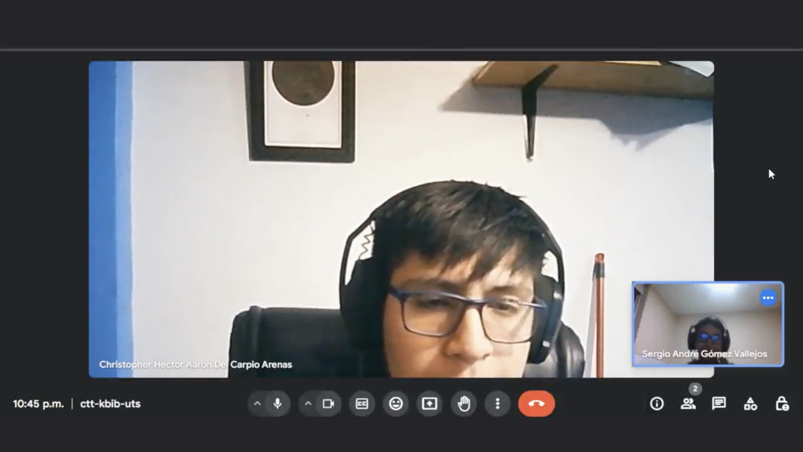|
| **Resumen:** Christopher prefiere usar su laptop y smartphone para leer libros digitales y audiolibros, eligiendo Windows y Android por su comodidad y variedad de aplicaciones. Valora plataformas con interfaces intuitivas, buenas recomendaciones personalizadas y una amplia biblioteca. Descubre libros a través de recomendaciones, redes sociales y reseñas, y disfruta tanto de libros digitales como de audiolibros para adaptarse a diferentes situaciones. La personalización de recomendaciones es crucial para él, y considera que interactuar con autores directamente sería enriquecedor. Mejora en accesibilidad y personalización en las plataformas existentes sería ideal. |

#### Entrevista 3
| **Datos del entrevistado** | 
|--------------------------|
| **Nombre:**  Sebastián Cosquillo |
| **Minuto del video:**  11:13|
| **Edad:**  19 años |
| **Procedencia:**  Lima, Comas |
| |
| **Resumen:** Sebastián prefiere leer libros y escuchar audiolibros en su celular con Android. Busca plataformas con una amplia variedad de títulos en español e inglés y con una interfaz fácil de usar. Descubre libros a través de recomendaciones y redes sociales, y le gusta combinar libros y audiolibros según la situación. Valora una plataforma que permita organizar su lectura, con listas personalizadas y seguimiento del progreso. También considera importante la personalización de recomendaciones y le gustaría interactuar con autores en una plataforma digital.|
 
### Segmento: Autores
#### Entrevista 1
| **Datos del entrevistado** | 
|--------------------------|
| **Nombre:**  Apaestegui Edquen Diego Sebastian |
| **Edad:**  23 años |
| **Minuto del video:**  15:43|
| **Procedencia:**  Lima, Lima |
| |
| **Resumen:** Sebastián Edquén destaca la importancia de la accesibilidad y la comodidad en la publicación digital, prefiriendo libros digitales por su facilidad de uso en diferentes dispositivos. Su experiencia resalta la necesidad de herramientas avanzadas de marketing y análisis en las plataformas de publicación, así como la valiosa interacción con lectores. Las funciones que faciliten la promoción y la gestión efectiva de contenidos son clave para mejorar su experiencia como autor en el entorno digital. |
#### Entrevista 2
| **Datos del entrevistado** | 
|--------------------------|
| **Nombre:**  José Manuel Qwistgaard Suárez |
| **Minuto del video:**  21:18|
| **Edad:**  63 años |
| **Procedencia:**  Lima, Lima |
| |
| **Resumen:** José Manuel Qwistgaard Suárez es un excoronel de la fuerza armada del Perú, secretario técnico del consejo de minitros y un escritor. Habiendo publicdo 2 libros tanto de manera física como digital, José Qwistgaard nos relata su experiencia con el proceso de publicación así también como el proceso de marketing. También explica el cómo la conexción que tienen los autores con sus leyentes es importate para el medio. Aunque no halla tenido ningún problema con el proceso de publicación que utiliza para sus libros, si a notado un percanse al momento de anunciarlos en redes sociales, pues hay algunos como los blogs que cobran por permitir publicitar sus libros. Normalmente utiliza documentos de Word para escribir el texto y luego utilizar otros programas para la edición final, siendo la laptop su medio preferido para editar y leer libros.|

#### Entrevista 3
| **Datos del entrevistado** | 
|--------------------------|
| **Nombre:**  Milosch Perez Mendoza |
| **Minuto del video:**  35:45|
| **Edad:**  25 años |
| **Procedencia:**  Lima, San Miguel |
| |
| **Resumen:** Milosch Perez es un joven escritor, que tiene ciertas predilecciones por los libros en formatos digital, tanto en su lectura como su distribución, él tiene estas preferencias por qué cree que sus obras tiene más protección  debido a las leyes de derechos de autor y administra sus obras en iPad y PC. En cuanto a la redacción de sus libros, él prefiere usar Microsoft Word 365, ya que le permite redactar en simultaneo con otros autores. Le gusta leer libros digitales, y la facilidad de acceder a los libros digitales, ya que puede hacerlo desde múltiples dispositivos. El descubre nuevas obras literarias por recomendaciones y por la publicación de los autores que sigue en redes sociales. A él le gustaría que su editor de texto tuviera la funcionalidad de grabar y convertir a su voz a texto. Milosch tambien cree que el feedback y la crítica de sus lectores es muy importante, ya que le permiten conocer más a sus lectores, y considerar estas críticas en sus futuras obras.|

#### Entrevista 4
| **Datos del entrevistado** | 
|--------------------------|
| **Nombre:**  Silvia Elizabet Rojas |
| **Edad:**  38 años |
| **Procedencia:**  Lima, Callao |
||
| **Resumen:** Silvia es licenciada en psicología y disfruta escribir con frecuencia. Su libro favorito es Viva la diferencia. Utiliza el sistema operativo Windows, y prefiere Microsoft Word y Google Docs para redactar sus textos. Silvia valora especialmente que una plataforma le facilite llegar a su público lector. Actualmente, publica sus escritos en redes sociales y le gusta recibir retroalimentación de sus lectores, ya que esto le ayuda a mejorar. Además, aprecia ver los comentarios e interacciones que sus publicaciones generan, pues le permiten evaluar si su contenido capta la atención del público.|

### 2.2.3. Análisis de Entrevistas

El análisis de las entrevistas realizadas a los segmentos de estudiantes y autores permitió identificar tendencias clave, preferencias y necesidades que guiarán el desarrollo de la plataforma **BookSphere**. Los hallazgos a continuación están respaldados por datos cuantitativos y cualitativos, reflejando las características y desafíos más comunes en ambos segmentos.

#### Segmento Estudiantes

De los estudiantes entrevistados, un **66%** indicó que uno de los principales obstáculos al intentar acceder a los materiales de lectura requeridos por sus cursos es la **falta de disponibilidad** de libros en formato físico, tanto en bibliotecas como en librerías. Además, el **66%** señaló que los costos de adquirir libros físicos representan una inversión que no siempre pueden afrontar.

En cuanto a la **preferencia de formato**, el **100%** de los estudiantes opta por los **libros digitales** y **audiolibros** debido a su facilidad de acceso, disponibilidad inmediata y la posibilidad de transportar su biblioteca en un solo dispositivo. El **33%** de los encuestados manifestó utilizar funciones adicionales, como la **sincronización entre dispositivos** y los **marcadores digitales**, para mejorar su experiencia de lectura.

En términos de **dispositivos preferidos** para leer:
- El **66%** prefiere leer en **dispositivos móviles** o **tablets** por su portabilidad y comodidad.
- El **33%** utiliza principalmente **computadoras de escritorio** o **portátiles**, alegando que la pantalla más grande les ayuda a concentrarse mejor.

Además, el **66%** de los estudiantes afirmó que la **falta de tiempo** es el principal obstáculo para leer tanto como desearían. Este dato justifica el aumento en la popularidad de los **audiolibros**, que permiten a los usuarios consumir contenido mientras realizan otras actividades como desplazarse al trabajo o hacer tareas domésticas.

En relación con el uso de **plataformas digitales**, el **100%** de los estudiantes expresó un interés significativo en utilizar una herramienta que centralice el acceso a diversos **recursos educativos** en un solo lugar, lo que refuerza la necesidad de una solución integral como **BookSphere**. Además, el **33%** valoró la posibilidad de **personalizar su experiencia** de lectura mediante recomendaciones basadas en sus intereses y hábitos de lectura.

#### Segmento Autores

De los autores entrevistados, el **33%** tiene experiencia previa en la publicación de libros en **formato digital**, mientras que el **33%** restante no ha hecho la transición debido a la falta de familiaridad con las plataformas o el temor a perder el control sobre sus obras. Sin embargo, el **100%** de los autores reconocen que las **plataformas digitales** son el futuro para llegar a una **audiencia más amplia** y diversa.

En cuanto a la interacción con los lectores, el **100%** de los autores subrayó la importancia de la **retroalimentación directa** mediante reseñas y comentarios. Consideran que este tipo de interacción les permite no solo mejorar su escritura, sino también conocer mejor a su audiencia y adaptar sus obras a los intereses cambiantes de los lectores. Un **33%** de los autores destacó que las reseñas y opiniones influyen significativamente en su **proceso creativo**, ya que les ofrecen una perspectiva externa valiosa.

Además, el **66%** de los autores considera cruciales las **herramientas de análisis** y estadísticas que les permiten conocer el rendimiento de sus libros, incluyendo datos como el número de lecturas, descargas y reseñas. Esta información es esencial para su **estrategia de crecimiento** y para comprender mejor el comportamiento de su audiencia.

En cuanto a la **monetización**, el **66%** de los autores desea tener mayor control sobre el **precio** de sus libros y las **opciones de distribución**. Ven en plataformas como **BookSphere** una oportunidad para ampliar sus canales de venta y llegar a nuevas audiencias sin depender completamente de intermediarios tradicionales.

#### Conclusiones Cuantitativas

En resumen, los resultados de las entrevistas indican una fuerte disposición por parte de estudiantes y autores para adoptar una plataforma como **BookSphere**. Las principales conclusiones cuantitativas incluyen:

- **66%** de los estudiantes tiene dificultades para acceder a libros físicos debido a costos y disponibilidad.
- **100%** prefiere libros digitales o audiolibros por su accesibilidad y conveniencia.
- **66.6%** de los estudiantes mencionan la falta de tiempo como la barrera principal para leer, lo que justifica el crecimiento de los audiolibros.
- **100%** de los estudiantes están interesados en una plataforma que centralice el acceso a recursos educativos.
- **33%** de los autores ha publicado libros en formato digital, y **100%** considera que las plataformas digitales son clave para alcanzar una audiencia más amplia.
- **100%** de los autores valoran la interacción con los lectores, y **66%** consideran fundamentales las herramientas de análisis sobre el rendimiento de sus libros.

Estos datos muestran una clara demanda por una solución digital que ofrezca tanto a estudiantes como a autores un entorno integrado y adaptado a sus necesidades, facilitando el acceso a contenidos y ofreciendo herramientas para la creación y distribución de libros.

## 2.3. Needfinding
### 2.3.1. User Personas
#### Segmento 1: Estudiantes

#### Segmento 2: Autores

Enlace de las entrevistas: https://acortar.link/Q5pT1u
### 2.3.2. User Task Matrix

Segmentos Considerados: En la siguiente matriz se han identificado tres segmentos clave que utilizamos en nuestra  plataforma BookSphere:
* Lectores Ocasionales: Personas que disfrutan de la lectura, pero no lo hacen de manera constante.
* Estudiantes: Usuarios que buscan recursos educativos para complementar su aprendizaje.
* Autores: Creadores que desean publicar y promocionar sus obras.

**Segmento Objetivo: Estudiantes**
“Buscar libros y recursos educativos” es una de las tareas más importantes, ya que los estudiantes necesitan acceder a materiales relevantes para su aprendizaje. Además, “Organizar y gestionar lecturas” es clave para mantener un seguimiento de sus estudios y tareas.

| Tareas                                                   | Frecuencia     | Importancia |
|----------------------------------------------------------|----------------|-------------|
| Buscar libros y recursos educativos.                     | Siempre        | Alta        |
| Preguntar a amigos o profesores por recomendaciones de libros. | A menudo       | Alta        |
| Navegar en sitios web para comparar precios y disponibilidad. | A menudo       | Alta        |
| Descargar o comprar libros en formato físico o digital.  | A menudo       | Alta        |
| Organizar y gestionar lecturas en un cuaderno o aplicación. | A menudo       | Media       |
| Participar en grupos de estudio o foros en línea.        | Ocasionalmente | Media       |
| Crear resúmenes o notas de los libros leídos.            | A menudo       | Alta        |
| Usar aplicaciones para seguir el progreso de lectura.    | A menudo       | Media       |
| Asistir a talleres o cursos relacionados con sus áreas de estudio. | Ocasionalmente | Media       |

**Segmento Objetivo: Autores**
“Investigar editoriales y enviar propuestas” es crucial para que los autores puedan distribuir su obra. También es importante “Promocionar sus libros en redes sociales” para conectar con su audiencia.

| Tareas                                                                  | Frecuencia     | Importancia |
|-------------------------------------------------------------------------|----------------|-------------|
| Investigar editoriales que acepten manuscritos y enviar propuestas.     | Siempre        | Alta        |
| Crear un sitio web o blog para promocionar sus libros.                  | A menudo       | Alta        |
| Participar en ferias de libros para conectar con lectores.              | Ocasionalmente | Media       |
| Usar redes sociales para promocionar sus libros.                        | A menudo       | Alta        |
| Recopilar feedback de los lectores a través de encuestas.               | A menudo       | Media       |
| Publicar artículos o relatos cortos en blogs o revistas literarias.     | Ocasionalmente | Media       |
| Crear un boletín informativo para mantener informados a sus seguidores. | Ocasionalmente | Media       |
| Colaborar con otros autores en antologías o proyectos conjuntos.        | Ocasionalmente | Media       |

**Segmento Objetivo: Lectores Casuales**
“Explorar nuevos títulos en librerías y bibliotecas” es fundamental para descubrir libros de interés. También, “Leer reseñas de libros” es clave para tomar decisiones informadas sobre qué leer.

| Tareas                                                         | Frecuencia     | Importancia |
|----------------------------------------------------------------|----------------|-------------|
| Explorar nuevos títulos en librerías y bibliotecas.            | Siempre        | Alta        |
| Pedir recomendaciones a amigos y grupos de lectura.            | A menudo       | Alta        |
| Leer reseñas de libros en sitios web o blogs.                  | A menudo       | Alta        |
| Comprar libros en línea o en físico.                           | A menudo       | Alta        |
| Participar en clubes de lectura locales.                       | Ocasionalmente | Media       |
| Hacer una lista de libros leídos y por leer.                   | A menudo       | Alta        |
| Compartir opiniones sobre libros en redes sociales.            | A menudo       | Media       |
| Asistir a eventos literarios o presentaciones de libros.       | Ocasionalmente | Media       |
| Usar aplicaciones para seguir recomendaciones personalizadas.  | A menudo       | Media       |

### 2.3.3. User Journey Mapping
**Estudiantes**
El recorrido de los estudiantes dentro de la plataforma comienza cuando descubren la herramienta como una solución para acceder a recursos educativos. Desde la inscripción en la plataforma hasta la exploración de libros y audiolibros, el proceso incluye la selección de materiales relevantes, la lectura o escucha de contenido, y la interacción con otras funcionalidades, como las reseñas y recomendaciones personalizadas. Finalmente, los estudiantes logran sus objetivos académicos aprovechando los recursos disponibles, lo que mejora su rendimiento académico y facilita su desarrollo educativo. Este mapa detalla cada etapa del viaje, identificando puntos clave de interacción y áreas donde se puede mejorar la experiencia del usuario.

**Autores**
El recorrido de los autores en la plataforma está enfocado en el proceso de publicación y la gestión de su contenido. Comienza cuando los autores descubren la plataforma como un medio para dar visibilidad a sus obras. A partir de ahí, crean una cuenta, suben sus libros y personalizan sus perfiles para maximizar su alcance. A lo largo del camino, interactúan con lectores a través de comentarios y evaluaciones, mientras buscan oportunidades para aumentar la visibilidad y las ventas de sus obras. Este mapa detalla sus motivaciones, frustraciones y necesidades a medida que avanzan hacia el logro de sus metas, proporcionando una comprensión profunda de su experiencia dentro de la plataforma.

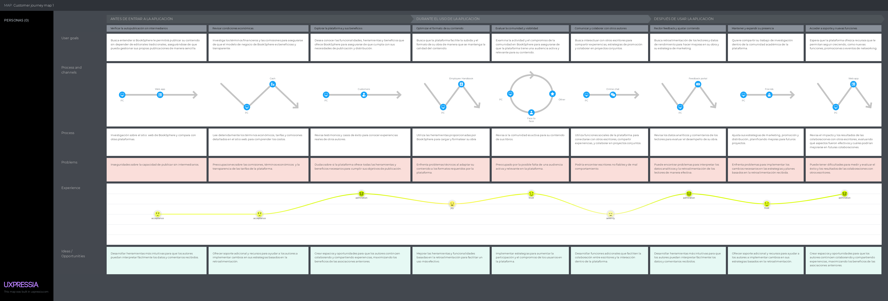
### 2.3.4. Empathy Mapping
#### Segmento 1: Estudiantes

#### Segmento 2: Autores

### 2.3.5. As-is Scenario Mapping

### Estudiantes

### Lectores Ocacionales

### Autores

    

## 2.4. Ubiquitous Language
    
**1. Digital Library (Biblioteca Digital)**
Una colección de libros, audiolibros y otros materiales educativos disponibles en formato digital y accesibles a través de una plataforma en línea.
    
**2. Interactive Content (Contenido Interactivo)**
Contenido digital que permite a los usuarios interactuar de diversas maneras, como mediante vistas previas interactivas, elementos multimedia o características personalizadas.
    
**3. Personalized Recommendations (Recomendaciones Personalizadas)**
Sugerencias de libros o materiales educativos adaptadas a los intereses, historial de lectura o metas de aprendizaje de un individuo, a menudo generadas mediante algoritmos o preferencias del usuario.
    
**4. Content Management (Gestión de Contenidos)**
El proceso de organizar, actualizar y mantener el contenido digital en una plataforma, incluyendo la carga de nuevos materiales y la gestión de los existentes.
    
**5. User Engagement (Participación del Usuario)**
 El nivel de interacción e involucramiento que un usuario tiene con la plataforma, incluyendo actividades como la lectura, reseñas y participación en discusiones comunitarias.
    
**6. Author Interaction (Interacción con el Autor)**
La capacidad para que los usuarios se relacionen directamente con los autores a través de funciones como sesiones de preguntas y respuestas, chats en vivo o blogs de autores.
    
**7. Feedback Loop (Ciclo de Retroalimentación)**
El proceso mediante el cual se recopila la retroalimentación de los usuarios y se utiliza para mejorar la plataforma o el contenido, incluyendo reseñas y calificaciones.
    
**8. Educational Resources (Recursos Educativos)**
Materiales diseñados para apoyar el aprendizaje y la educación, como libros de texto, guías de estudio y contenido instructivo.
    
**9. Content Visibility (Visibilidad del Contenido)**
El grado en que el contenido digital es accesible y descubrible para los usuarios, influenciado por factores como la funcionalidad de búsqueda y las herramientas de promoción.
    
**10. Publisher Partnership**
Asociación con Acuerdos colaborativos entre la plataforma y las editoriales para distribuir y promover libros y materiales educativos.
    
**11. Digital Rights Management (DRM) (Gestión de Derechos Digitales)**
Tecnología y políticas utilizadas para proteger el contenido digital contra la distribución no autorizada y la piratería, asegurando que los autores y editores mantengan el control sobre su trabajo.
    
**12. Community Features (Funciones Comunitarias)**
Herramientas y funcionalidades que facilitan la interacción y el compromiso de los usuarios dentro de la plataforma, como foros de discusión, reseñas de usuarios y opciones de compartir en redes sociales.
    
**13. Platform Usability (Usabilidad de la Plataforma)**
 La facilidad con la que los usuarios pueden navegar y utilizar la plataforma, incluyendo aspectos como el diseño intuitivo, la accesibilidad y el soporte al usuario.
    
**14. Content Updates (Actualizaciones de Contenido)**
El proceso de modificar o agregar nuevas versiones de materiales digitales, incluyendo revisiones, nuevas ediciones o correcciones de contenido existente.

# 1. Capítulo III: Requirements Specification
## 3.1. To-Be Scenario Mapping
#### Leyentes
| Escenarios | Doing | Thinking | Feeling |
| :---- | :---- | :---- | :---- |
| Comprar libros en una plataforma digital | \-Iniciar Sesión en la plataforma \-Ir a la sección de ventas \-Buscar libros por filtros o palabras clave \-Leer las calificaciones y reseñas \-Comprar el libro para ti o para otro usuario | \-¿Qué tipo de libro me gustaría comprar? \-¿Hay descuentos u ofertas disponibles? \-¿Que tan bueno es el libro según su calificación? | \-Emocionado \-Intrigado \-Curioso \-Decepcionado (de no encontrar lo que quiere) |
| DIalogar con otros leyentes y autores | \-Iniciar sesión \-Ir a la sección de la comunidad \-Crear o entrar a foros y discusiones con otros usuarios en la plataforma \-Conversar privadamente con otros leyentes y autores | \-¿Qué temas me interesan dialogar? \-¿Habrá autores o leyendas que pueda conocer y socializar? \-¿Habrá alguién que tenga una duda o resuelva las mías? | \-Feliz \-Emoción \-Enojado \-Enojo \-Expresivo |
| Administrar biblioteca digital | \-Iniciar sesión en la plataforma \-Ir a biblioteca personal \-Organizar mis compras por filtros o colecciones personalizadas | \-¿Cómo puedo ordenar mis libros y artículos? \-¿Cuáles quiero agrupar y por qué? \-¿Cuáles están en mi lista actual de lectura? | \-Concentrado \-Intrigado \-Tranquilo o estresado (según el avance) |
| Falla de la plataforma | \-Comprar un libro pero la transacción falla \-Robo de cuenta \-Sin acceso al contenido comprado \-Contacto con el soporte | \-¿Qué habrá pasado? \-¿Fue error mío o del sistema lo que pasó? \-¿Qué solución habrá para esta situación? | \-Enojado \-Decepcionado \-Fastidio |

#### Autores
| Escenarios | Doing | Thinking | Feeling |
| :---- | :---- | :---- | :---- |
| Publicar Libros en una plataforma digital | \-Iniciar sesión \-Ir al perfil de usuario \-Seleccionar la opción de publicar un libro \-Seleccionar la opción de publicar un libro | \-¿En qué formato publicó el libro? \-¿Que filtros agrego a mi página para facilitar su búsqueda? \-¿Qué precio sería el justo para este producto? | \-Emocionado \-Feliz \-Ansioso |
| Interactuar con los leyentes | \-Iniciar sesión \-Ir a la sección de comunidad \-Empezar a dialogar con los leyentes de tus obras y relacionados | \-¿Qué opinan mis lectores de mis obras? \-¿Que me recomiendan mis lectores para mis obras futuras? \-¿Que brindo a mis lectores por estas interacciones? | \-Emocionado \-Curioso \-Pensativo |
| Crear anuncios | \-Publicar un libro en la plataforma \-Crear un enlace de la página de publicación \-Crear publicidad en las redes sociales que redirija a la plataforma | \-¿Cómo puedo captar a mi público objetivo? \-¿Qué redes sociales son mejores para anunciar este tipo de medio? \-¿Qué tipo de formato (videos, imágenes, etc.) puedo utilizar para anunciar mi obra?  | \-Concentrado \-Creativo \-Entusiasmado \-Ansioso |
| Colaboraciones | \-Iniciar sesión \-Dialogar con amigos registrados en la plataforma para crear un trabajo juntos \-Anunciar una colaboración en la sección de comunidad de la plataforma \-Anunciar una colaboración en la sección de comunidad de la plataforma \-Adjuntar los avances del trabajo en un repositorio privado de la plataforma \-Publicar el trabajo  | \-¿Quiénes me podrían ayudar a hacer un trabajo juntos? \-¿Qué temas trabajaremos y cuánto nos demoraremos en hacerlo? \-¿Qué precio merece nuestro trabajo cuando se publique? | \-Emocionado \-Creativo \-Ansioso \-Entusiasmado \-Concentrado |

## 3.2. User Stories
| *Epic/Story ID* | *Título*                            | *Descripción*                                                                                                                                 | *Criterios de Aceptación*                                                                                                                                                                                                                                                                                                                                                                   | *Relacionado con (Epic ID)* |
|-------------------|---------------------------------------|-------------------------------------------------------------------------------------------------------------------------------------------------|---------------------------------------------------------------------------------------------------------------------------------------------------------------------------------------------------------------------------------------------------------------------------------------------------------------------------------------------------------------------------------------------|-------------------------------|
| Epic 1            | Registro y Acceso de Usuario          | Como usuario, quiero registrarme y acceder a mi cuenta para gestionar mis libros y configuraciones personales.                                   |                                                                                                                                                                                                                                                                                                                                                                                             |                               |
| Story 001         | Registro de Usuario                   | Como nuevo usuario, quiero registrarme en la plataforma para acceder a mis libros y configuraciones personales.                                  | Scenario 1: Registro exitoso   Given estoy en la página de registro   When ingreso mi información válida y envío el formulario   Then mi cuenta se crea y recibo un mensaje de confirmación.    Scenario 2: Error en el registro   Given estoy en la página de registro   When ingreso información incorrecta   Then se muestra un mensaje de error y mi cuenta no se crea. | Epic 1                        |
| Story 002         | Inicio de Sesión                      | Como usuario registrado, quiero iniciar sesión para acceder a mi cuenta y gestionar mis libros.                                                  | Scenario 1: Inicio de sesión exitoso   Given tengo una cuenta registrada   When ingreso mis credenciales correctas   Then accedo a mi cuenta y soy redirigido a mi panel de usuario.    Scenario 2: Error en el inicio de sesión   Given tengo una cuenta registrada   When ingreso credenciales incorrectas   Then se muestra un mensaje de error y no accedo a mi cuenta. | Epic 1                        |
| Story 003         | Recuperar Contraseña                  | Como usuario, quiero recuperar mi contraseña para acceder a mi cuenta en caso de olvido.                                                          | Scenario 1: Recuperación exitosa   Given he olvidado mi contraseña   When sigo el proceso de recuperación y creo una nueva contraseña   Then recibo una confirmación de que mi contraseña ha sido cambiada exitosamente.    Scenario 2: Error en la recuperación   Given he olvidado mi contraseña   When el proceso de recuperación falla   Then se muestra un mensaje de error. | Epic 1                        |
| Story 004         | Cambiar Idioma de la Interfaz         | Como usuario, quiero cambiar el idioma de la interfaz para utilizar la aplicación en mi idioma preferido.                                         | Scenario 1: Cambio de idioma exitoso   Given estoy en la sección de configuración   When selecciono un idioma preferido   Then la interfaz cambia al idioma seleccionado.    Scenario 2: Error en el cambio de idioma   Given estoy en la sección de configuración   When selecciono un idioma preferido y falla   Then se muestra un mensaje de error y no se aplica el cambio. | Epic 1                        |
| Epic 2            | Gestión de Biblioteca                 | Como usuario, quiero gestionar mi biblioteca para organizar mis libros y materiales de lectura.                                                   |                                                                                                                                                                                                                                                                                                                                                                                             |                               |
| Story 005         | Añadir Libros a la Biblioteca          | Como usuario, quiero añadir libros a mi biblioteca para tener acceso a ellos desde mi cuenta.                                                     | Scenario 1: Añadir libro exitosamente   Given estoy en la sección de biblioteca   When selecciono un libro y lo añado a mi biblioteca   Then el libro aparece en mi biblioteca y recibo una confirmación.    Scenario 2: Error al añadir libro   Given estoy en la sección de biblioteca   When ocurre un problema técnico   Then se muestra un mensaje de error y el libro no se añade a mi biblioteca. | Epic 2                        |
| Story 006         | Eliminar Libros de la Biblioteca       | Como usuario, quiero eliminar libros de mi biblioteca para mantenerla organizada y actualizada.                                                   | Scenario 1: Eliminar libro exitosamente   Given tengo un libro en mi biblioteca   When selecciono el libro y elijo eliminarlo   Then el libro se elimina de mi biblioteca y recibo una confirmación.    Scenario 2: Error al eliminar libro   Given tengo un libro en mi biblioteca   When ocurre un problema técnico   Then se muestra un mensaje de error y el libro no se elimina. | Epic 2                        |
| Story 007         | Buscar Libros                         | Como usuario, quiero buscar libros en mi biblioteca para encontrar rápidamente el material que necesito.                                          | Scenario 1: Búsqueda exitosa   Given estoy en la sección de búsqueda   When ingreso el título del libro y realizo la búsqueda   Then se muestran los resultados relevantes y puedo acceder al libro.    Scenario 2: No se encuentra el libro   Given estoy en la sección de búsqueda   When ingreso un título que no está en la biblioteca   Then se muestra un mensaje indicando que no se encontraron resultados. | Epic 2                        |
| Epic 3            | Interacción Social y Comunidad         | Como usuario, quiero interactuar con otros usuarios para compartir recomendaciones y reseñas sobre libros.                                        |                                                                                                                                                                                                                                                                                                                                                                                             |                               |
| Story 008         | Recomendar Libros a Otros Usuarios     | Como usuario, quiero recomendar libros a otros usuarios para compartir mis lecturas favoritas.                                                    | Scenario 1: Recomendación enviada exitosamente   Given estoy en la página de un libro   When selecciono recomendar a un amigo y envío la recomendación   Then mi recomendación es enviada y el destinatario recibe una notificación.    Scenario 2: Error al enviar recomendación   Given estoy en la página de un libro   When ocurre un problema técnico   Then se muestra un mensaje de error y la recomendación no se envía. | Epic 3                        |
| Story 009         | Escribir Reseñas de Libros             | Como usuario, quiero escribir reseñas de libros para compartir mi opinión sobre los libros que he leído.                                           | Scenario 1: Reseña enviada exitosamente   Given he leído un libro   When escribo una reseña y la envío   Then la reseña se publica en la página del libro y otros usuarios pueden verla.    Scenario 2: Error al enviar reseña   Given he leído un libro   When ocurre un problema técnico al enviar la reseña   Then se muestra un mensaje de error y la reseña no se publica. | Epic 3                        |
| Story 010         | Ver Comentarios de los Usuarios        | Como usuario, quiero ver los comentarios de los usuarios de la aplicación en la interfaz para tomar decisiones informadas.                        | Scenario 1: Comentarios visibles   Given estoy en la página de comentarios   When reviso los comentarios de otros usuarios   Then puedo ver los comentarios publicados por otros usuarios.    Scenario 2: Error al cargar comentarios   Given estoy en la página de comentarios   When ocurre un problema técnico   Then se muestra un mensaje de error y no puedo ver los comentarios. | Epic 3                        |
| Epic 4            | Funcionalidades de Adquisición         | Como usuario, quiero adquirir libros y contenidos para ampliar mi biblioteca personal.                                                             |                                                                                                                                                                                                                                                                                                                                                                                             |                               |
| Story 011         | Enviar Mensajes a Otros Usuarios       | Como usuario, quiero enviar mensajes a otros usuarios para interactuar y discutir sobre libros y temas relacionados.                               | Scenario 1: Mensaje enviado exitosamente   Given estoy en la página de mensajes   When escribo un mensaje y lo envío   Then el mensaje se envía y el destinatario recibe una notificación.    Scenario 2: Error al enviar mensaje   Given estoy en la página de mensajes   When ocurre un problema técnico   Then se muestra un mensaje de error y el mensaje no se envía. | Epic 4                        |
| Story 012         | Recibir Notificaciones de Mensajes     | Como usuario, quiero recibir notificaciones cuando recibo nuevos mensajes para estar al tanto de las interacciones.                                | Scenario 1: Notificación recibida exitosamente   Given recibo un nuevo mensaje   When el sistema detecta el nuevo mensaje   Then recibo una notificación en mi cuenta.    Scenario 2: Error en la notificación   Given recibo un nuevo mensaje   When ocurre un problema técnico en el sistema de notificaciones   Then no recibo una notificación y el problema se informa al usuario. | Epic 4                        |
| Story 013         | Añadir Libros al Carrito               | Como estudiante, quiero añadir libros al carrito para revisar mi selección antes de proceder a la compra.                                          | Scenario 1: Añadir al carrito exitosamente   Given estoy en la página del libro   When hago clic en "Añadir al carrito"   Then el libro se añade a mi carrito de compras y recibo una confirmación.    Scenario 2: Error al añadir al carrito   Given estoy en la página del libro   When hay un problema técnico   Then se muestra un mensaje de error y el libro no se añade al carrito. | Epic 4                        |
| Story 014         | Procesar Pago                         | Como usuario, quiero procesar el pago de los libros en mi carrito para completar la compra y obtener acceso al contenido.                          | Scenario 1: Pago exitoso   Given tengo libros en mi carrito   When realizo el pago con una tarjeta válida   Then la transacción se completa y recibo una confirmación del pago y acceso a los libros adquiridos.    Scenario 2: Error en el pago   Given tengo libros en mi carrito   When ocurre un problema con el pago   Then se muestra un mensaje de error y el pago no se procesa. | Epic 4                        |
| Story 015         | Filtros de Búsqueda                   | Como usuario, quiero aplicar filtros de búsqueda en la plataforma para obtener resultados más rápidos y relevantes.                                 | Scenario 1: Filtro aplicado exitosamente   Given estoy en la sección de búsqueda   When aplico filtros como género, autor, o año   Then los resultados se actualizan de acuerdo a los criterios seleccionados.    Scenario 2: Error en la búsqueda   Given estoy aplicando filtros de búsqueda   When ocurre un problema técnico   Then se muestra un mensaje de error y los filtros no se aplican correctamente. | Epic 4                        |
| Story 016         | Facilidades de Pago                   | Como usuario, quiero acceder a diferentes facilidades de pago para completar la compra de libros de manera conveniente.                            | Scenario 1: Facilidad de pago seleccionada exitosamente   Given estoy en la sección de pago   When elijo una facilidad de pago como cuotas o diferentes métodos de pago   Then el sistema procesa la transacción de acuerdo con las opciones seleccionadas.    Scenario 2: Error al seleccionar facilidad de pago   Given estoy en la sección de pago   When ocurre un problema técnico   Then se muestra un mensaje de error y no puedo seleccionar la facilidad de pago. | Epic 4                        |
| Epic 5            | Personalización de Perfil              | Como usuario, quiero personalizar mi perfil para que mi cuenta refleje mis preferencias y estilo personal.                                          |                                                                                                                                                                                                                                                                                                                                                                                             |                               |
| Story 017         | Editar Información del Perfil          | Como usuario, quiero editar mi información personal en mi perfil para actualizar mis datos y preferencias.                                          | Scenario 1: Edición exitosa   Given estoy en la página de perfil   When edito mi información y guardo los cambios   Then mi perfil se actualiza con la nueva información y recibo una confirmación.    Scenario 2: Error al editar perfil   Given estoy en la página de perfil   When ocurre un problema técnico   Then se muestra un mensaje de error y mi información no se actualiza. | Epic 5                        |
| Story 018         | Subir Imagen de Perfil                 | Como usuario, quiero subir una imagen de perfil para personalizar mi cuenta y hacerla más reconocible.                                             | Scenario 1: Imagen subida exitosamente   Given estoy en la página de perfil   When subo una imagen y guardo los cambios   Then la imagen se actualiza en mi perfil y recibo una confirmación.    Scenario 2: Error al subir imagen   Given estoy en la página de perfil   When ocurre un problema técnico al subir la imagen   Then se muestra un mensaje de error y la imagen no se sube. | Epic 5                        |
| Story 019         | Configurar Preferencias de Notificaciones | Como usuario, quiero configurar mis preferencias de notificaciones para recibir solo la información que me interesa.                                | Scenario 1: Preferencias configuradas exitosamente   Given estoy en la página de configuraciones de notificaciones   When configuro mis preferencias y guardo los cambios   Then mis preferencias se actualizan y recibo una confirmación.    Scenario 2: Error al configurar preferencias   Given estoy en la página de configuraciones   When ocurre un problema técnico   Then se muestra un mensaje de error y las preferencias no se actualizan. | Epic 5                        |
| Epic 6            | Soporte y Contacto                    | Como usuario, quiero tener acceso al soporte y contacto para resolver cualquier problema o pregunta que pueda tener.                               |                                                                                                                                                                                                                                                                                                                                                                                             |                               |
| Story 020         | Enviar Consulta al Soporte             | Como usuario, quiero enviar una consulta al soporte para obtener ayuda con cualquier problema que enfrente.                                         | Scenario 1: Consulta enviada exitosamente   Given estoy en la página de soporte   When envío mi consulta y recibo una confirmación   Then mi consulta es recibida y recibo una notificación de que el soporte está trabajando en ella.    Scenario 2: Error al enviar consulta   Given estoy en la página de soporte   When ocurre un problema técnico al enviar la consulta   Then se muestra un mensaje de error y la consulta no se envía. | Epic 6                        |
| Story 021         | Acceder a Preguntas Frecuentes         | Como usuario, quiero acceder a una sección de preguntas frecuentes para encontrar respuestas a dudas comunes sin necesidad de contactar al soporte. | Scenario 1: Acceso a preguntas frecuentes exitoso   Given estoy en la página de preguntas frecuentes   When navego por las preguntas y respuestas   Then encuentro la información que necesito y puedo resolver mis dudas.    Scenario 2: Error en la sección de preguntas frecuentes   Given estoy en la página de preguntas frecuentes   When ocurre un problema técnico   Then se muestra un mensaje de error y no puedo acceder a la información. | Epic 6                        |
| Story 022         | Enviar Comentarios sobre la Plataforma | Como usuario, quiero enviar comentarios sobre la plataforma para contribuir a su mejora.                                                           | Scenario 1: Comentario enviado exitosamente   Given estoy en la página de comentarios   When envío mi comentario y recibo una confirmación   Then mi comentario es recibido y el equipo de desarrollo toma nota de mis sugerencias.    Scenario 2: Error al enviar comentario   Given estoy en la página de comentarios   When ocurre un problema técnico al enviar el comentario   Then se muestra un mensaje de error y el comentario no se envía. | Epic 6                        |
| Epic 7            | Funcionalidades para Estudiantes       | Como estudiante, quiero acceder a funcionalidades específicas para facilitar mi experiencia académica en la plataforma BookSphere.                  |                                                                                                                                                                                                                                                                                                                                                                                             |                               |
| Story 023         | Explorar Catálogo de Libros            | Como estudiante, quiero explorar el catálogo de libros y audiolibros para descubrir recursos educativos relevantes.                                 | Scenario 1: Catálogo visible correctamente   Given estoy en la página de catálogo   When navego por los títulos   Then puedo ver y explorar la colección de libros y audiolibros.    Scenario 2: Error en el catálogo   Given estoy en la página de catálogo   When ocurre un problema técnico   Then se muestra un mensaje de error y no puedo ver el catálogo. | Epic 7                        |
| Story 024         | Acceder a Reseñas y Detalles           | Como estudiante, quiero acceder a reseñas y detalles de libros para tomar decisiones informadas sobre qué leer o estudiar.                          | Scenario 1: Reseñas y detalles visibles   Given estoy en la página de un libro   When consulto la sección de reseñas y detalles   Then puedo leer las reseñas y ver la información detallada del libro.    Scenario 2: Error en reseñas y detalles   Given estoy en la página de un libro   When ocurre un problema técnico   Then se muestra un mensaje de error y no puedo ver la información. | Epic 7                        |
| Story 025         | Añadir Libros a Favoritos              | Como estudiante, quiero añadir libros a mis favoritos para tener fácil acceso a mis títulos preferidos y recomendaciones.                           | Scenario 1: Libros añadidos a favoritos   Given estoy en la página de un libro   When añado el libro a mis favoritos   Then el libro se guarda en mi lista de favoritos.    Scenario 2: Error al añadir a favoritos   Given estoy en la página de un libro   When ocurre un problema técnico   Then se muestra un mensaje de error y el libro no se añade a favoritos. | Epic 7                        |
| Story 026         | Participar en Discusiones de Libros    | Como estudiante, quiero participar en discusiones sobre libros para intercambiar ideas y opiniones con otros usuarios.                              | Scenario 1: Discusión publicada   Given estoy en la sección de discusiones   When publico un comentario   Then mi comentario aparece en la discusión.    Scenario 2: Error en discusiones   Given estoy en la sección de discusiones   When ocurre un problema técnico   Then se muestra un mensaje de error y mi comentario no se publica. | Epic 7                        |
| Story 027         | Recibir Recomendaciones de Lectura     | Como estudiante, quiero recibir recomendaciones de lectura basadas en mi historial y preferencias para descubrir nuevos títulos que se alineen con mis intereses. | Scenario 1: Recomendaciones recibidas   Given estoy en la sección de recomendaciones   When reviso las sugerencias   Then recibo recomendaciones que coinciden con mis intereses.    Scenario 2: Error en recomendaciones   Given estoy en la sección de recomendaciones   When ocurre un problema técnico   Then se muestra un mensaje de error y no recibo recomendaciones. | Epic 7                        |
| Story 028         | Ver Historial de Lectura               | Como estudiante, quiero ver mi historial de lectura para seguir mi progreso y revisar los libros que he leído anteriormente.                        | Scenario 1: Historial de lectura visible   Given estoy en la sección de historial de lectura   When reviso mi historial   Then puedo ver todos los libros que he leído y su información.    Scenario 2: Error en historial de lectura   Given estoy en la sección de historial de lectura   When ocurre un problema técnico   Then se muestra un mensaje de error y no puedo ver el historial. | Epic 7                        |
| Story 029         | Revisar Feedback de Lectores           | Como estudiante, quiero revisar el feedback de otros lectores sobre los libros para hacer una elección informada antes de leer o adquirir un título. | Scenario 1: Feedback visible   Given estoy en la página de un libro   When consulto las reseñas y comentarios   Then puedo ver el feedback de otros lectores.                                                                                                                                                                                                                                | Epic 7                        |
| Epic 8            | Funcionalidades para Autores           | Como autor, quiero acceder a funcionalidades específicas para gestionar mis libros y conectar con la comunidad en la plataforma BookSphere.         |                                                                                                                                                                                                                                                                                                                                                                                             |                               |
| Story 030         | Publicar Libros Digitales              | Como autor, quiero publicar mis libros digitales en BookSphere para llegar a un público más amplio y compartir mi trabajo.                          | Scenario 1: Libro publicado correctamente   Given estoy en la sección de publicación   When subo y configuro un libro digital   Then el libro se publica y está disponible en la plataforma.    Scenario 2: Error en publicación   Given estoy en la sección de publicación   When ocurre un problema técnico   Then se muestra un mensaje de error y el libro no se publica. | Epic 8                        |
| Story 031         | Actualizar Información del Libro       | Como autor, quiero actualizar la información de mis libros para asegurarme de que los detalles y el contenido estén siempre actualizados.            | Scenario 1: Información actualizada   Given estoy en la página de gestión de libros   When actualizo la información de un libro   Then los cambios se reflejan en la plataforma.    Scenario 2: Error en actualización   Given estoy en la página de gestión de libros   When ocurre un problema técnico   Then se muestra un mensaje de error y la información no se actualiza. | Epic 8                        |
| Story 032         | Gestionar Comentarios y Reseñas        | Como autor, quiero gestionar los comentarios y reseñas de mis libros para responder a los lectores y mejorar mi trabajo basado en sus opiniones.     | Scenario 1: Comentarios gestionados   Given estoy en la sección de comentarios   When reviso y respondo a los comentarios   Then puedo interactuar con los lectores y gestionar las reseñas.    Scenario 2: Error en gestión de comentarios   Given estoy en la sección de comentarios   When ocurre un problema técnico   Then se muestra un mensaje de error y no puedo gestionar los comentarios. | Epic 8                        |
| Story 033         | Acceder a Estadísticas de Lectura      | Como autor, quiero acceder a estadísticas sobre la lectura de mis libros para analizar el rendimiento y entender mejor a mi audiencia.               | Scenario 1: Estadísticas accesibles   Given estoy en la sección de estadísticas   When consulto los datos   Then puedo ver estadísticas sobre la lectura de mis libros.    Scenario 2: Error en estadísticas   Given estoy en la sección de estadísticas   When ocurre un problema técnico   Then se muestra un mensaje de error y no puedo acceder a las estadísticas. | Epic 8                        |
| Story 034         | Promocionar Libros en la Plataforma    | Como autor, quiero promocionar mis libros en la plataforma para aumentar su visibilidad y atraer a más lectores.                                     | Scenario 1: Promoción visible   Given estoy en la sección de promociones   When configuro una campaña de promoción   Then mi libro aparece en las áreas destacadas de la plataforma.    Scenario 2: Error en promoción   Given estoy en la sección de promociones   When ocurre un problema técnico   Then se muestra un mensaje de error y la promoción no se configura. | Epic 8                        |
| Story 035         | Gestionar Derechos de Autor            | Como autor, quiero gestionar los derechos de autor de mis libros para proteger mi trabajo y asegurar que se respete mi propiedad intelectual.        | Scenario 1: Derechos gestionados correctamente   Given estoy en la sección de derechos de autor   When configuro los derechos de mi libro   Then los derechos están correctamente gestionados y protegidos.    Scenario 2: Error en gestión de derechos   Given estoy en la sección de derechos de autor   When ocurre un problema técnico   Then se muestra un mensaje de error y los derechos no se gestionan correctamente. | Epic 8                        |
| Story 036         | Acceder a Información sobre Tendencias | Como autor, quiero acceder a información sobre las tendencias de lectura para adaptar mis escritos a los intereses actuales del público.             | Scenario 1: Tendencias accesibles   Given estoy en la sección de tendencias   When consulto la información sobre tendencias de lectura   Then puedo ver las tendencias actuales y adaptar mi trabajo en consecuencia.    Scenario 2: Error en tendencias   Given estoy en la sección de tendencias   When ocurre un problema técnico   Then se muestra un mensaje de error y no puedo acceder a la información sobre tendencias. | Epic 8                        |
| Story 037         | Recibir Feedback de Lectores           | Como autor, quiero recibir feedback sobre mis libros para mejorar mis escritos y entender mejor las necesidades de mis lectores.                    | Scenario 1: Feedback recibido exitosamente   Given mis libros están publicados en la plataforma   When recibo feedback de los lectores   Then puedo acceder a los comentarios y utilizar la retroalimentación para mejorar mi trabajo.    Scenario 2: Error en feedback   Given mis libros están publicados   When ocurre un problema técnico   Then no recibo feedback y se muestra un mensaje de error. | Epic 8                        |
| Story 038         | Crear Contenido Exclusivo              | Como autor, quiero crear contenido exclusivo para mis seguidores para ofrecerles material adicional y fomentar su interés en mis libros.            | Scenario 1: Contenido exclusivo creado exitosamente   Given soy un autor con seguidores   When creo contenido adicional y lo publico para mis seguidores   Then el contenido exclusivo está disponible y los usuarios suscritos pueden acceder a él.    Scenario 2: Error en la creación de contenido   Given estoy creando contenido exclusivo   When ocurre un problema técnico   Then no se publica el contenido y se muestra un mensaje de error. | Epic 8                        |
| Epic 9            | Mejora de la Navegación y Funcionalidades del Usuario           | Como usuario de BookSphere, quiero tener acceso a una serie de funcionalidades que mejoren mi experiencia        |                                                                                                                                                                                                                                                                                                                                                                                             |                               |
| US039           | Acceso a la sección de Nosotros       | Como usuario, quiero acceder a la sección de Nosotros para conocer más sobre la plataforma.                                                    | Scenario 1   Given que estoy en la página principal,   When selecciono la opción "Nosotros",   Then debería ser redirigido a la sección correspondiente con la información sobre la plataforma.     Scenario 2   Given que la sección de "Nosotros" está cargando lentamente,   When selecciono la opción "Nosotros",   Then debería ver un mensaje de carga y esperar hasta que se cargue.    Scenario 3   Given que la sección de "Nosotros" no está disponible,   When selecciono la opción "Nosotros",   Then debería recibir un mensaje de error informando que la sección no está disponible en este momento. | Epic 9 |
| US040           | Incluir Internacionalización (i18n)   | Como usuario, quiero poder cambiar el idioma de la plataforma para utilizarla en mi idioma preferido.                                          |Scenario 1   Given que estoy en la plataforma y hay varios idiomas disponibles,   When selecciono un idioma diferente del menú de idiomas,   Then el contenido de la plataforma debería actualizarse en el nuevo idioma seleccionado.    Scenario 2   Given que estoy en la plataforma y selecciono un idioma con errores,   When cambio el idioma,   Then debería ver un mensaje informativo sobre la disponibilidad del idioma y algunos textos podrían no traducirse correctamente.     Scenario 3   Given que estoy en la plataforma y el sistema falla al cambiar el idioma,   When selecciono un nuevo idioma,   Then debería recibir un mensaje de error indicando que no se pudo cambiar el idioma. | Epic 9 |
| US041           | Acceso a la sección de Características | Como usuario, quiero acceder a la sección de Características para entender las funcionalidades de la plataforma.                               | Scenario 1   Given que estoy en la página principal,   When selecciono la opción "Características",   Then debería ser redirigido a la sección correspondiente con las características de la plataforma.     Scenario 2   Given que la sección de "Características" está cargando lentamente,   When selecciono la opción "Características",   Then debería ver un mensaje de carga y esperar hasta que se cargue.     Scenario 3   Given que la sección de "Características" no está disponible,   When selecciono la opción "Características",   Then debería recibir un mensaje de error informando que la sección no está disponible en este momento. | Epic 9 |
| US042           | Sector de tipo de usuarios disponibles | Como usuario, quiero ver los diferentes tipos de usuarios disponibles para saber con quién puedo interactuar.                                  | Scenario 1   Given que estoy en la sección de usuarios,   When reviso la lista de usuarios,   Then debería ver los diferentes tipos de usuarios disponibles en la plataforma.     Scenario 2   Given que la lista de usuarios se está actualizando,   When reviso la lista de usuarios,   Then debería ver una lista parcial o un mensaje informando que los datos están siendo actualizados.     Scenario 3   Given que la lista de usuarios no se puede cargar,   When reviso la sección de usuarios,   Then debería recibir un mensaje de error indicando que no se puede acceder a la lista de usuarios. | Epic 9 |
| US043           | Sector sección de comentarios         | Como usuario, quiero acceder a la sección de comentarios para leer y dejar opiniones sobre la plataforma.                                     | Scenario 1   Given que estoy en la página principal,   When selecciono la opción "Comentarios",   Then debería ser redirigido a la sección correspondiente donde puedo leer y dejar comentarios.    Scenario 2   Given que la sección de comentarios tiene una gran cantidad de datos,   When selecciono la opción "Comentarios",   Then debería ver un mensaje de carga y esperar hasta que los comentarios se muestren.     Scenario 3   Given que la sección de comentarios no está disponible,   When selecciono la opción "Comentarios",   Then debería recibir un mensaje de error informando que la sección no está disponible en este momento. | Epic 9 |
| US044           | Acceso a la sección de Como Funciona  | Como usuario, quiero entender cómo funciona la plataforma accediendo a la sección de Cómo Funciona.                                            | Scenario 1    Given que estoy en la página principal,   When selecciono la opción "Cómo Funciona",   Then debería ser redirigido a la sección correspondiente con una explicación detallada sobre el funcionamiento de la plataforma.     Scenario 2   Given que la sección de "Cómo Funciona" está cargando lentamente,   When selecciono la opción "Cómo Funciona",   Then debería ver un mensaje de carga y esperar hasta que se muestre la explicación.     Scenario 3   Given que la sección de "Cómo Funciona" no está disponible,   When selecciono la opción "Cómo Funciona",   Then debería recibir un mensaje de error informando que la sección no está disponible en este momento. | Epic 9 |

## Historias Técnicas

| **Historias técnicas ID** | **Título**                             | **Descripción**                                                                                                                                                                                                                       | **Criterios de Aceptación**                                                                                                                                                                                                                                                                                                                                                       |
|--------|----------------------------------------|-------------------------------------------------------------------------------------------------------------------------------------------------------------------------------------------------------------------------------------------|-----------------------------------------------------------------------------------------------------------------------------------------------------------------------------------------------------------------------------------------------------------------------------------------------------------------------------------------------------------------------------------|
| TS001  | Crear Cuenta de Usuario                | Como desarrollador, quiero que los usuarios puedan crear una cuenta en BookSphere para acceder a la plataforma y sus recursos.                                                | **Scenario 1: Registro exitoso**   **Given** que el endpoint "/register" está disponible   **When** se envía una solicitud POST con datos válidos para el registro   **Then** se recibe una respuesta con estado 201 Created   **And** el usuario tiene una cuenta activa.    **Scenario 2: Error en registro**   **Given** que el endpoint "/register" está disponible   **When** se envía una solicitud POST con datos inválidos   **Then** se recibe una respuesta con estado 400 Bad Request   **And** un mensaje de error "Email ya registrado". |
| TS002  | Iniciar Sesión                         | Como desarrollador, quiero que los usuarios puedan iniciar sesión en BookSphere usando sus credenciales para acceder a sus cuentas.                                           | **Scenario 1: Inicio de sesión exitoso**   **Given** que el endpoint "/login" está disponible   **When** se envía una solicitud POST con credenciales válidas   **Then** se recibe una respuesta con estado 200 OK   **And** un token de autenticación válido.    **Scenario 2: Error en inicio de sesión**   **Given** que el endpoint "/login" está disponible   **When** se envía una solicitud POST con credenciales inválidas   **Then** se recibe una respuesta con estado 401 Unauthorized   **And** un mensaje de error "Credenciales inválidas". |
| TS003  | Buscar Libros                         | Como desarrollador, quiero implementar una funcionalidad de búsqueda para que los usuarios puedan encontrar libros en BookSphere por título, autor o género.                   | **Scenario 1: Búsqueda exitosa**   **Given** que el endpoint "/search" está disponible   **When** se envía una solicitud GET con un criterio de búsqueda válido   **Then** se recibe una respuesta con estado 200 OK   **And** una lista de libros que coinciden con el criterio.    **Scenario 2: Búsqueda sin resultados**   **Given** que el endpoint "/search" está disponible   **When** se envía una solicitud GET con un criterio de búsqueda que no coincide con ningún libro   **Then** se recibe una respuesta con estado 404 Not Found   **And** un mensaje de error "No se encontraron libros". |
| TS004  | Agregar Libro a la Biblioteca          | Como desarrollador, quiero permitir que los administradores agreguen nuevos libros a la biblioteca de BookSphere a través de un formulario en la interfaz de usuario.         | **Scenario 1: Libro agregado exitosamente**   **Given** que el formulario para agregar libros está disponible   **When** se completa el formulario con datos válidos   **Then** el libro se guarda en la base de datos y es visible en la biblioteca.    **Scenario 2: Error al agregar libro**   **Given** que el formulario para agregar libros está disponible   **When** se completa el formulario con datos inválidos   **Then** se muestra un mensaje de error "Datos inválidos para el libro". |
| TS005  | Actualizar Información del Libro       | Como desarrollador, quiero permitir que los administradores actualicen la información de un libro existente en la biblioteca de BookSphere a través de la interfaz de usuario.                                     | **Scenario 1: Actualización exitosa**   **Given** que el formulario para actualizar libros está disponible   **When** se actualizan los datos del libro con información válida   **Then** la información del libro se actualiza correctamente en la base de datos.    **Scenario 2: Error en la actualización**   **Given** que el formulario para actualizar libros está disponible   **When** se actualizan los datos del libro con información inválida   **Then** se muestra un mensaje de error "Datos inválidos para el libro". |
| TS006  | Eliminar Libro de la Biblioteca        | Como desarrollador, quiero permitir que los administradores eliminen libros de la biblioteca de BookSphere a través de un botón en la interfaz de usuario.                                                 | **Scenario 1: Eliminación exitosa**   **Given** que el botón de eliminación está disponible   **When** se elimina un libro existente   **Then** el libro se borra de la base de datos y ya no está visible en la biblioteca.    **Scenario 2: Error al eliminar libro**   **Given** que el botón de eliminación está disponible   **When** se intenta eliminar un libro que no existe   **Then** se muestra un mensaje de error "Libro no encontrado". |
| TS007  | Gestionar Reseñas de Libros             | Como desarrollador, quiero permitir que los usuarios agreguen y gestionen reseñas de libros en BookSphere a través de la interfaz de usuario.                                                               | **Scenario 1: Reseña agregada exitosamente**   **Given** que el formulario para agregar reseñas está disponible   **When** se envía una reseña válida   **Then** la reseña se guarda en la base de datos y es visible en la página del libro.    **Scenario 2: Error al agregar reseña**   **Given** que el formulario para agregar reseñas está disponible   **When** se envía una reseña inválida   **Then** se muestra un mensaje de error "Datos inválidos para la reseña". |
| TS008  | Implementar Funcionalidad de Favoritos  | Como desarrollador, quiero que los usuarios puedan marcar libros como favoritos en BookSphere a través de la interfaz de usuario.                                                | **Scenario 1: Libro marcado como favorito**   **Given** que la opción para marcar favoritos está disponible   **When** se marca un libro como favorito   **Then** el libro aparece en la lista de favoritos del usuario.    **Scenario 2: Error al marcar libro como favorito**   **Given** que la opción para marcar favoritos está disponible   **When** se intenta marcar un libro como favorito pero hay un problema   **Then** se muestra un mensaje de error "No se pudo marcar el libro como favorito". |
| TS009  | Implementar Recomendaciones Personalizadas | Como desarrollador, quiero que BookSphere ofrezca recomendaciones personalizadas a los usuarios basadas en su historial de lectura.                                          | **Scenario 1: Recomendaciones generadas exitosamente**   **Given** que el sistema de recomendaciones está integrado   **When** un usuario accede a la sección de recomendaciones   **Then** se muestran recomendaciones basadas en el historial de lectura del usuario.    **Scenario 2: Error en recomendaciones**   **Given** que el sistema de recomendaciones está integrado   **When** hay un problema técnico al generar recomendaciones   **Then** se muestra un mensaje de error indicando que no se pueden generar recomendaciones. |
| TS010  | Implementar Funcionalidad de Filtros en Búsqueda | Como desarrollador, quiero añadir filtros a la funcionalidad de búsqueda para que los usuarios puedan refinar sus resultados de búsqueda según diferentes criterios.            | **Scenario 1: Filtros aplicados exitosamente**   **Given** que los filtros están implementados   **When** un usuario aplica filtros en la búsqueda   **Then** los resultados se actualizan para mostrar solo los elementos que cumplen con los criterios.    **Scenario 2: Error en aplicación de filtros**   **Given** que los filtros están implementados   **When** hay un problema técnico al aplicar los filtros   **Then** se muestra un mensaje de error indicando que los filtros no se pueden aplicar. |
| TS011  | Implementar Funcionalidad de Exportación de Datos | Como desarrollador, quiero permitir a los usuarios exportar datos en formatos comunes como CSV o Excel para facilitar el análisis externo.                                  | **Scenario 1: Exportación exitosa**   **Given** que la funcionalidad de exportación está implementada   **When** un usuario solicita exportar datos   **Then** se genera un archivo en el formato solicitado y se proporciona al usuario para descargar.    **Scenario 2: Error en exportación**   **Given** que la funcionalidad de exportación está implementada   **When** hay un problema técnico al generar el archivo   **Then** se muestra un mensaje de error indicando que la exportación no se pudo completar. |
| TS012  | Implementar Funcionalidad de Seguimiento de Lectura | Como desarrollador, quiero que los usuarios puedan rastrear su progreso de lectura en BookSphere para llevar un registro de los libros que están leyendo.                        | **Scenario 1: Progreso de lectura registrado exitosamente**   **Given** que la funcionalidad de seguimiento de lectura está implementada   **When** un usuario actualiza su progreso de lectura   **Then** el progreso se guarda en la base de datos y se muestra correctamente en la interfaz de usuario.    **Scenario 2: Error al registrar progreso de lectura**   **Given** que la funcionalidad de seguimiento de lectura está implementada   **When** hay un problema técnico al registrar el progreso   **Then** se muestra un mensaje de error indicando que no se pudo actualizar el progreso de lectura. |

## 3.3. Impact Mapping
El impact mapping es una técnica de planificación estratégica que visualiza cómo las actividades y proyectos contribuyen a objetivos de negocio específicos. Utiliza un mapa para mostrar los impactos deseados, los actores involucrados, los objetivos a alcanzar y las entregas necesarias para lograr esos objetivos. Facilita la alineación de esfuerzos con metas estratégicas y mejora la toma de decisiones al clarificar el valor y los resultados esperados.

### Business Goal: 
 Que el 30% de estudiantes que encuentran el libro que buscaban lo compren
 
 
### Business Goal:
 Captar la atención de los lectores para incentivarlos a comprar los libros
 

## 3.4. Product Backlog

| *Orden* | *User Story*                       | *Título*                         | *Descripción*                                                                 | *Story Points* |
|-----------|-------------------------------------|------------------------------------|---------------------------------------------------------------------------------|------------------|
| 1         | Story 001                            | Registro de Usuario                | Como nuevo usuario, quiero registrarme en la plataforma para acceder a mis libros y configuraciones personales.  | 1                |
| 2         | Story 002                            | Inicio de Sesión	                  | Como usuario registrado, quiero iniciar sesión para acceder a mi cuenta y gestionar mis libros. | 2                |
| 3         | Story 003                            | Recuperación de Contraseña         | Como usuario, quiero recuperar mi contraseña para poder acceder a mi cuenta en caso de olvido. | 2                |
| 4         | Story 004                            | Cambiar Idioma de la Interfaz       | Como usuario, quiero cambiar el idioma de la interfaz para utilizar la aplicación en mi idioma preferido. | 3                |
| 5         | Story 005                            | Añadir Libros a la Biblioteca    | Como usuario, quiero añadir libros a mi biblioteca para tener acceso a ellos desde mi cuenta. | 2                |
| 6         | Story 006                            | Eliminar Libros de la Biblioteca                       | Como usuario, quiero eliminar libros de mi biblioteca para mantenerla organizada y actualizada.| 2                |
| 7         | Story 007                            |Buscar Libros | Como usuario, quiero buscar libros en mi biblioteca para encontrar rápidamente el material que necesito. | 2                |
| 8         | Story 008                            | Recomendar Libros a Otros Usuarios         | Como usuario, quiero recomendar libros a otros usuarios para compartir mis lecturas favoritas. | 3                |
| 9         | Story 009                            | Escribir Reseñas de Libros    | Como usuario, quiero escribir reseñas de libros para compartir mi opinión sobre los libros que he leído. | 3                |
| 10        | Story 010                            | Ver Comentarios de los Usuarios  | Como usuario, quiero ver los comentarios de los usuarios de la aplicación en la interfaz para tomar decisiones informadas. | 2                |
| 11        | Story 011                            | Enviar Mensajes a Otros Usuarios            | Como usuario, quiero enviar mensajes a otros usuarios para interactuar y discutir sobre libros y temas relacionados. | 3                |
| 12        | Story 012                            | Recibir Notificaciones de Mensajes	                     | Como usuario, quiero recibir notificaciones cuando recibo nuevos mensajes para estar al tanto de las interacciones. | 2                |
| 13        | Story 013                            | Añadir Libros al Carrito      | Como estudiante, quiero añadir libros al carrito para revisar mi selección antes de proceder a la compra. | 2                |
| 14        | Story 014                            | Procesar Pago              | Como usuario, quiero procesar el pago de los libros en mi carrito para completar la compra y obtener acceso al contenido. | 2                |
| 15        | Story 015                            | Filtros de Búsqueda | Como usuario, quiero aplicar filtros de búsqueda en la plataforma para obtener resultados más rápidos y relevantes. | 1                |
| 16        | Story 016                            | Facilidades de Pago          | Como usuario, quiero acceder a diferentes facilidades de pago para completar la compra de libros de manera conveniente.  | 3                |
| 17        | Story 017                            | Editar Información del Perfil      | Como usuario, quiero editar mi información personal en mi perfil para actualizar mis datos y preferencias. | 2                |
| 18        | Story 018                            | Subir Imagen de Perfil | Como usuario, quiero subir una imagen de perfil para personalizar mi cuenta y hacerla más reconocible. | 2                |
| 19        | Story 019                            | Configurar Preferencias de Notificaciones         | Como usuario, quiero configurar mis preferencias de notificaciones para recibir solo la información que me interesa. | 2                |
| 20        | Story 020                            | Enviar Consulta al Soporte       | Como usuario, quiero enviar una consulta al soporte para obtener ayuda con cualquier problema que enfrente. | 3                |
| 21        | Story 021                            | Acceder a Preguntas Frecuentes           | Como usuario, quiero acceder a una sección de preguntas frecuentes para encontrar respuestas a dudas comunes sin necesidad de contactar al soporte. | 3                |
| 22        | Story 022                            | Enviar Comentarios sobre la Plataforma          | Como usuario, quiero enviar comentarios sobre la plataforma para contribuir a su mejora.   | 2                |
| 23        | Story 023                            | Explorar Catálogo de Libros       | Como estudiante, quiero explorar el catálogo de libros y audiolibros para descubrir recursos educativos relevantes. | 2                |
| 24        | Story 024                            | Acceder a Reseñas y Detalles | Como estudiante, quiero acceder a reseñas y detalles de libros para tomar decisiones informadas sobre qué leer o estudiar. | 3                |
| 25        | Story 025                            | Añadir Libros a Favoritos          | Como estudiante, quiero añadir libros a mis favoritos para tener fácil acceso a mis títulos preferidos y recomendaciones.  | 2                |
| 26        | Story 026                            | Participar en Discusiones de Libros  | Como estudiante, quiero participar en discusiones sobre libros para intercambiar ideas y opiniones con otros usuarios. | 3                |
| 27        | Story 027                            | Recibir Recomendaciones de Lectura     | Como estudiante, quiero recibir recomendaciones de lectura basadas en mi historial y preferencias para descubrir nuevos títulos que se alineen con mis intereses.| 2                |
| 28        | Story 028                            | Ver Historial de Lectura            | Como estudiante, quiero ver mi historial de lectura para seguir mi progreso y revisar los libros que he leído anteriormente. | 2                |
| 29       | Story 029                            | Revisar Feedback de Lectores        | Como estudiante, quiero revisar el feedback de otros lectores sobre los libros para hacer una elección informada antes de leer o adquirir un título. | 2                |
| 30       | Story 030                           | Publicar Libros Digitales      | Como autor, quiero publicar mis libros digitales en BookSphere para llegar a un público más amplio y compartir mi trabajo. | 2                |
| 31        | Story 031                            | Actualizar Información del Libro    | Como autor, quiero actualizar la información de mis libros para asegurarme de que los detalles y el contenido estén siempre actualizados.    | 2                |
| 32        | Story 032                            | Gestionar Comentarios y Reseñas           | Como autor, quiero gestionar los comentarios y reseñas de mis libros para responder a los lectores y mejorar mi trabajo basado en sus opiniones.  | 3                |
| 33       | Story 033                            | Acceder a Estadísticas de Lectura    | Como autor, quiero acceder a estadísticas sobre la lectura de mis libros para analizar el rendimiento y entender mejor a mi audiencia.  | 2                |
| 34       | Story 034                            | Promocionar Libros en la Plataforma     |Como autor, quiero promocionar mis libros en la plataforma para aumentar su visibilidad y atraer a más lectores. | 3                |
| 35       | Story 035                            | Gestionar Derechos de Autor   | Como autor, quiero gestionar los derechos de autor de mis libros para proteger mi trabajo y asegurar que se respete mi propiedad intelectual.  | 3                |
| 36       | Story 036                            | Acceder a Información sobre Tendencias | Como autor, quiero acceder a información sobre las tendencias de lectura para adaptar mis escritos a los intereses actuales del público.  | 2                |
| 37       | Story 037                            | Recibir Feedback de Lectores          | Como autor, quiero recibir feedback sobre mis libros para mejorar mis escritos y entender mejor las necesidades de mis lectores. | 2                |
| 38       | Story 038                            | Crear Contenido Exclusivo           | Como autor, quiero crear contenido exclusivo para mis seguidores para ofrecerles material adicional y fomentar su interés en mis libros. | 3                |
| 39      | Story 39                             | Acceso a la sección de Nosotros   | Como usuario, quiero acceder a la sección de Nosotros para conocer más sobre la plataforma. | 3                |
| 40      | Story 40                             | Incluir Internacionalización (i18n)| Como usuario, quiero poder cambiar el idioma de la plataforma para utilizarla en mi idioma preferido. | 3                |
| 41      | Story 41                              | Acceso a la sección de Características | Como usuario, quiero acceder a la sección de Características para entender las funcionalidades de la plataforma. | 3                |
| 42      | Story 42                               | Sector de tipo de usuarios disponibles | Como usuario, quiero ver los diferentes tipos de usuarios disponibles para saber con quién puedo interactuar. | 2               |
| 43      | Story 43                               | Sector sección de comentarios      | Como usuario, quiero acceder a la sección de comentarios para leer y dejar opiniones sobre la plataforma. | 2                |
| 44      | Story 44                               | Acceso a la sección de Cómo Funciona | Como usuario, quiero entender cómo funciona la plataforma accediendo a la sección de Cómo Funciona. | 2               |

| *Orden* | *Technical Story*                        | *Título*                               | *Descripción*                                                                                          | *Story Points (1 / 2 / 3)* |
|-----------|--------------------------------------------|------------------------------------------|----------------------------------------------------------------------------------------------------------|------------------------------|
| 1         | TS001                                      | Crear Cuenta de Usuario                  | Permitir a los usuarios crear una cuenta para acceder a la plataforma.                                    | 1                            |
| 2         | TS002                                      | Iniciar Sesión                           | Permitir a los usuarios iniciar sesión con sus credenciales para acceder a sus cuentas.                   | 2                            |
| 3         | TS003                                      | Buscar Libros                            | Implementar una funcionalidad de búsqueda de libros por título, autor o género.                           | 3                            |
| 4         | TS004                                      | Agregar Libro a la Biblioteca            | Permitir a los administradores agregar nuevos libros a la biblioteca.                                     | 2                            |
| 5         | TS005                                      | Actualizar Información del Libro         | Permitir a los administradores actualizar la información de un libro existente.                           | 1                            |
| 6         | TS006                                      | Eliminar Libro de la Biblioteca          | Permitir a los administradores eliminar libros de la biblioteca.                                          | 3                            |
| 7         | TS007                                      | Gestionar Reseñas de Libros              | Permitir a los usuarios agregar y gestionar reseñas de libros.                                            | 2                            |
| 8         | TS008                                      | Implementar Sistema de Valoración        | Implementar un sistema de valoración para que los usuarios puedan calificar libros.                       | 3                            |
| 9         | TS009                                      | Implementar Funcionalidad de Favoritos   | Permitir a los usuarios marcar libros como favoritos.                                                     | 2                            |
| 10        | TS010                                      | Implementar Recomendaciones Personalizadas | Ofrecer recomendaciones personalizadas a los usuarios basadas en su historial de lectura.                | 1                            |
| 11        | TS011                                      | Configurar Notificaciones de Nuevas Publicaciones | Notificar a los usuarios sobre nuevas publicaciones de libros.                                         | 2                            |
| 12        | TS012                                      | Actualizar Sistema de Seguridad          | Mejorar la seguridad de la plataforma para proteger la información personal de los usuarios.               | 2                            |
| 13        | TS013                                      | Integrar Sistema de Pago                 | Implementar la integración con un sistema de pago para la compra de libros.                               | 3                            |
| 14        | TS014                                      | Optimizar Rendimiento de Búsquedas       | Optimizar la funcionalidad de búsqueda para mejorar el rendimiento y la velocidad de los resultados.       | 3                            |
| 15        | TS015                                      | Implementar API de Recomendaciones       | Crear una API para proporcionar recomendaciones automáticas de libros a los usuarios.                     | 2                            |
| 16        | TS016                                      | Mejorar Diseño de la Interfaz            | Actualizar el diseño de la interfaz de usuario para mejorar la experiencia de navegación en la plataforma. | 2                            |
| 17        | TS017                                      | Implementar Historial de Lectura         | Permitir a los usuarios revisar el historial de los libros que han leído en la plataforma.                 | 2                            |
| 18        | TS018                                      | Automatizar Envío de Correos             | Implementar un sistema automatizado para el envío de correos electrónicos a los usuarios.                  | 1                            |
| 19        | TS019                                      | Implementar Cambio de Idioma             | Permitir a los usuarios cambiar el idioma de la interfaz en la aplicación.                                | 2                            |
| 20        | TS020                                      | Visualización de Comentarios de Usuarios | Implementar la visualización de comentarios de los usuarios en la interfaz de la aplicación.               | 2                            |

# 4. Capítulo IV: Product Design
## 4.1. Style Guidelines
Las Style Guidelines son fundamentales para mantener una comunicación cohesiva y profesional en todos los aspectos de la marca o proyecto, ya sea en publicaciones impresas, en línea o en cualquier otro medio de difusión. En esta sección estableceremos el conjunto de directrices que usará nuestro equipo para diseñar el proyecto BookSphere. Estas pautas definirán aspectos como la elección de colores, tipografía, estructura del documento, entre otros elementos. Para el diseño de BookSphere, utilizaremos la plataforma Figma para la creación de la aplicación web y la página de inicio. Ambas incluirán una paleta de colores con tonalidades de marrón y gris, que evocan calidez, sofisticación y modernidad, reflejando la conexión entre la tradición de la lectura y la innovación digital. A continuación, se presenta un detalle más amplio de cada aspecto mencionado.
### 4.1.1. General Style Guidelines
El logotipo de BookSphere no es solo una imagen, es la representación visual de nuestra identidad. En el centro, el símbolo que nos representa es una esfera estilizada, que simboliza un universo de conocimiento accesible para todos. Este logotipo fusiona la idea de tecnología y literatura, dos pilares clave de nuestra misión. Es versátil y se adapta a diversas plataformas y aplicaciones, asegurando que nuestra marca se mantenga coherente y distintiva en cualquier contexto. Este logo transmite la innovación, accesibilidad y conexión que buscamos ofrecer a nuestros usuarios, tanto estudiantes como autores, en su búsqueda de libros y materiales educativos.
Logotipo del producto:   

  
 Horizontal layout
   

  
Inverted Colors
  
**Typography**
**Font Families:**
- **Rushen Shadow: Usada para el logotipo del proyecto. Su estilo distintivo y decorativo ayuda a destacar la identidad de BookSphere.**    
 

- **Poppins: Empleada para los encabezados y títulos. Ofrece una lectura clara y moderna, ideal para captar la atención en la plataforma.**    
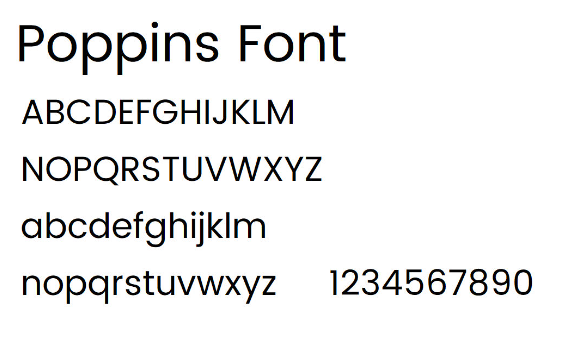

- **Noto Sans: Aplicada al cuerpo del texto. Su diseño versátil facilita la lectura y la comprensión de la información.**    

- **Roboto: Utilizada para botones y llamados a la acción. Su aspecto limpio y moderno ayuda a mejorar la interacción del usuario.**    

- **Raleway: Reservada para detalles y elementos destacados. Añade un toque de sofisticación a la interfaz.**    

- **Arial: Seleccionada para el texto legal y el pie de página. Garantiza legibilidad y profesionalismo.**    

  
 
**Colores**

**La selección de colores en BookSphere ha sido cuidadosamente diseñada para reflejar la modernidad y la conexión entre la tecnología y la lectura. La paleta de colores está compuesta por:**

- **Rojo anaranjado (#e04e0b):** Representa energía y dinamismo, aportando un toque vibrante a la página.  
  

- **Naranja claro (#e4864f):** Evoca calidez y accesibilidad, creando una atmósfera acogedora.  
  

- **Gris claro (#e9ebeb):** Aporta claridad y modernidad, manteniendo la elegancia del diseño.  
  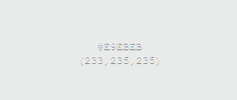

- **Blanco  (#ffffff):** Simboliza pureza y simplicidad, dando un aspecto limpio a la página.  
  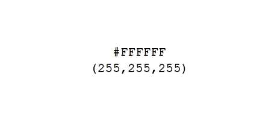
- **Gris muy claro (#F5F5F5):**   Añade una ligera variación de gris, manteniendo la sobriedad en el diseño.  
  
  
- **Marrón oscuro (#3E2723):** Transmite seriedad y sofisticación, ideal para resaltar elementos importantes.  
  
  
  
Estos colores no solo crean una armonía visual en la plataforma, sino que también refuerzan la identidad de BookSphere como una solución innovadora para el acceso a libros y materiales educativos. La combinación de estos tonos contribuye a una experiencia de usuario enriquecedora, que combina la tradición de la lectura con la modernidad de la tecnología, y refleja nuestro compromiso con la excelencia en el diseño y la funcionalidad.

### Espaciado en la Plataforma Web de BookSphere

La plataforma web de **BookSphere** está diseñada para ofrecer una experiencia de lectura y navegación cómoda y clara. A continuación, se detallan las especificaciones de espaciado recomendadas para garantizar la legibilidad y la organización visual de la plataforma:

#### Espaciado entre líneas (line-height)
- **Texto de cuerpo:** El espaciado entre líneas debe ser de 1.4 a 1.6 veces el tamaño de la fuente. Esto asegura que el texto sea fácil de leer y que haya suficiente separación para evitar una sensación de aglomeración.

#### Espaciado entre párrafos
- **Margen inferior:** Debe ser al menos el 120% del tamaño de la fuente entre párrafos. Este margen proporciona un espacio adecuado para la separación de ideas y facilita la lectura continua sin interrupciones visuales incómodas.

#### Margen y espaciado alrededor de elementos de la interfaz
- **Espacio entre elementos de la interfaz:** Al menos 20 píxeles de espacio debe mantenerse entre los elementos de la interfaz para asegurar que cada componente tenga suficiente separación y sea fácilmente accesible.

#### Espaciado entre secciones o módulos
- **Margen superior e inferior:** Debe ser de al menos 45 píxeles. Esto asegura que las secciones de la página estén claramente delimitadas y que haya suficiente espacio entre diferentes bloques de contenido.

#### Espaciado entre elementos de menú y navegación
- **Espacio entre elementos de navegación:** Al menos 15 píxeles de espacio debe mantenerse entre los elementos de navegación para evitar una apariencia desordenada y mejorar la accesibilidad.

#### Espaciado alrededor de imágenes y gráficos
- **Margen alrededor de imágenes:** Debe haber al menos 20 píxeles de margen alrededor de las imágenes y gráficos. Esto asegura que los elementos visuales no se sientan aglomerados y que el contenido relacionado esté claramente separado.

#### Espaciado en el pie de página
- **Margen superior e inferior:** Debe ser de alrededor de 40 a 60 píxeles. Este espaciado proporciona un equilibrio visual y asegura que el pie de página esté claramente diferenciado del contenido principal.

### 4.1.2. Web Style Guidelines

## 4.2. Information Architecture
### 4.2.1. Organization Systems

A continuación, explicaremos en qué grupos de información se aplicaron los distintos tipos de organización visual para ambos segmentos objetivo, así como en cuáles se utiliza algún tipo de categorización.

1. **Lista de libros y recursos digitales:** Los usuarios podrán ver una lista completa de todos los libros, audiolibros y materiales educativos disponibles en BookSphere. Si un libro les interesa, podrán agregarlo a su biblioteca personal o comenzar a leerlo inmediatamente. Además, podrán visualizar reseñas, puntuaciones y recomendaciones personalizadas antes de tomar su decisión.

2. **Historial de publicaciones:** Cada autor o editor tendrá acceso a un historial completo de sus publicaciones en la plataforma. En este historial, podrán editar la información de cualquier obra previamente subida, actualizar versiones, o incluso eliminar contenido si lo consideran necesario, otorgándoles un control total sobre su material.

3. **Historial de lectura:** Cada usuario contará con un historial detallado de los libros y recursos que ha leído o explorado en BookSphere. Este historial también incluirá información sobre el progreso en sus lecturas actuales, lo que facilita retomar la lectura desde donde la dejaron.

4. **Mensajes y Comunicación:** Los usuarios podrán comunicarse directamente entre ellos o con los autores a través de la plataforma. Esta función facilitará la interacción entre lectores y creadores, permitiendo que los usuarios compartan sus opiniones, hagan preguntas, o coordinen actividades relacionadas con el contenido.

### 4.2.2. Labeling Systems

| Ícono  | Descripción |
|------------|------------|
|   | **Perfil:** En BookSphere, el ícono de perfil permitirá a los usuarios acceder a su información personal, modificar sus datos, ver su historial de lectura o publicación y gestionar sus preferencias.  |
|   | **Mensajes:** Los usuarios lo usarán para comunicarse entre sí, tanto Autores como Lectores, o recibir notificaciones de novedades, recomendaciones personalizadas, o mensajes de la comunidad.  |
|  | **Biblioteca:** Un ícono que permite a los usuarios acceder a su biblioteca personal donde pueden ver todos los libros y audiolibros que han adquirido o guardado.  |
|     | **Buscar:** Un ícono para buscar libros, autores, o recursos específicos dentro de la plataforma. |
|   | **Reseñas:** Un ícono para acceder a las reseñas que el usuario ha dejado o para ver las reseñas de otros usuarios sobre un libro específico.  |
|   | **Descargas:** Un ícono que permita a los usuarios acceder a los libros o recursos descargados para su lectura o escucha offline. |
|  | **Configuración:** Un ícono de engranaje que permita a los usuarios acceder a las opciones de configuración de su cuenta, como la gestión de preferencias de notificación o personalización del perfil. |
|  | **Home:** Un ícono para llevar a los usuarios de vuelta a la pantalla de inicio o la página principal de la plataforma. Generalmente se representa con una casa o un edificio. |
|   | **Notificaciones:** Un ícono de campana que notifique a los usuarios sobre eventos importantes, actualizaciones, o interacciones dentro de la plataforma. |

### 4.2.3. SEO Tags and Meta TagS

**1. SEO Tags**  
a. Title Tag: BookSphere - Tu mundo de libros y audiolibros a solo un clic.  
b. Meta Description Tag: Descubre, compra y disfruta de una vasta colección de libros y audiolibros en nuestra plataforma diseñada para lectores apasionados.  
(Aqupi irá captura de google) 

**2. Meta Tags**  
a. Meta Robots Tag: Emplearemos index y follow para que BookSphere pueda ser mostrada en los motores de búsqueda:    
`<meta name="author" content="BookSphere Inc.">`   
b. Meta Author Tag: Ya que el nombre del startup es BookSphere, podríamos colocar lo siguiente:   
`<meta name="author" content="BookSphere Inc.">`  
c. Meta Author Tag: Ya que el nombre del proyecto es BookSphere, podríamos incluir el siguiente meta tag:  
`<meta name="author" content="BookSphere Inc.">`

### 4.2.4 Searching Systems  
A continuación, se mostrarán los sistemas de búsqueda implementados para ayudar a nuestros usuarios a encontrar lo que están buscando.

**Para el caso de Web Application:**  

**Segmento 1: Estudiantes**  
- **Buscar libros:** Esta acción permitirá a los estudiantes buscar libros o audiolibros de su interés, filtrando por autor, título, género, y otros criterios relevantes.  
- **Mi librería:** Los estudiantes podrán acceder a su biblioteca personal donde verán todos los libros y audiolibros que han adquirido o guardado. 
**Segmento 2: Autores**  
- **Publicar libro:** Esta función permitirá a los autores cargar su obra y ponerla a disposición de los lectores en la plataforma.  
- **Ver comentarios:** Los autores podrán revisar los comentarios y reseñas que los lectores han dejado sobre sus libros para conocer las opiniones y retroalimentación.  
**Ambos segmentos:**  
- **Mensajes:** Permitirá a los usuarios comunicarse entre sí, tanto Autores como Lectores, o recibir notificaciones de novedades, recomendaciones personalizadas, o mensajes de la comunidad.

---

### 4.2.5 Navigation Systems  
A continuación, se mostrarán los sistemas de navegación que le permitirán a nuestros usuarios moverse a través de las distintas piezas de contenido o información.  

Como se mencionó anteriormente en el _Labeling Systems_, contamos con los siguientes "headings": **Store, Library, Community, Friends, y Language**.  

Por otro lado, en el caso de la Web Application, se tendrá una barra de navegación lateral donde se encontrarán las secciones principales de la interfaz del usuario. Estas secciones se navegan de la siguiente forma:

- **Home:** Sección a la cual se ingresa por defecto al momento de iniciar sesión, donde se muestran algunas noticias relevantes y opciones enfocadas a cada segmento objetivo.
- **My profile:** Si el usuario desea editar su perfil, solo debe ingresar a esta sección que se encuentra en la barra de navegación lateral.
- **News:** Si el usuario desea ver una noticia, solo debe ingresar a esta sección que se encuentra en la barra de navegación lateral, y una vez dentro, seleccionar la noticia de su interés.
- **Configuration:** Si el usuario desea editar la configuración de la interfaz, solo debe ingresar a esta sección que se encuentra en la barra de navegación lateral y ajustar los cambios correspondientes.
- **Reviews:** Si el autor desea revisar las reseñas que escriben sobre él, solo debe ingresar a esta sección que se encuentra en la barra de navegación lateral.

---

## 4.3. Landing Page UI Design
## 4.3.1. Landing Page Wireframe
Tomando en cuenta las decisiones de diseño y arquitectura explicadas anteriormente, el landing page debe contener información necesaria que atrape a los usuarios y lo ayuden a decidir a descargar nuestra aplicación. Para ello, hemos decidido que el diseño del landing page sea atractivo para el usuario y contenga solo la información más importante, así como las características que ofrece y la opinión de los usuarios. Para ello realizaremos wireframes que nos permitirá esbozar nuestras primeras ideas para la implementación del landing page en los dispositivos Desktop y Mobile. Esta contendrá la estructura que deseamos y el uso que le daremos a cada uno de los assets que hemos seleccionado. 
### Desktop Web Browser:
Estructura del Landing Page en Desktop Web Browser.
### Wireframe de Inicio:
Sección principal del landing page. Se mostrará una descripción inicial y un menú de opciones.

### Wireframe de Experiencia:
Sección que mostrará datos estadísticos respecto a la experiencia que han recibido los usuarios que han utilizado la aplicación y descripción de estas experiencias.

### Wireframe de Cómo Funciona la Aplicación:
Sección que mostrará información de cómo funciona la app en la parte izquierda. En la parte opuesta se utilizarán imágenes para ilustrar dichas funciones.

### Wireframe de Características:
Sección que mostrará las principales características que presenta la app. Estas serán dividas por un icóno que las represente junto a un texto que permita entender a los usuarios el propósito de la función.

### Wireframe de Usuarios:
Sección que mostrará lo que piensan nuestros usuarios mediante una barra horizontal para el desplazo. Además, se mostrará información de la diferencia de usuarios dentro de la plataforma (Estudiante y Autor).

### Wireframe de Descargar:
Sección que muestra la estructura que mostrará las opciones de descarga de la aplicación y una sección final con la información de derechos de autor de la aplicación.

### Mobile Web Browser:
Estructura del Landing Page en Mobile Web Browser.
### Wireframe de Inicio:
Sección principal del Landing Page. Se mostrará una descripción inicial y un ícono desplegable para el menú de opciones, permite el desplazamiento de la página.

### Wireframe de Experiencia:
Sección que mostrará datos estadísticos respecto a la experiencia que han recibido los usuarios que han utilizado la aplicación y descripción de estas experiencias.

### Wireframe de Cómo funciona la app:
Sección que mostrará información de cómo funciona la app en la parte izquierda. En la parte opuesta se utilizarán imágenes para ilustrar dichas funciones.

### Wireframe de Características:
Sección que mostrará las principales características que presenta la app. Estas serán dividas por un icóno que las represente junto a un texto que permita entender a los usuarios el propósito de la función.

### Wireframe de Usuarios:
Sección que mostrará lo que piensan nuestros usuarios mediante una barra horizontal para el desplazo. Además, se mostrará información de la diferencia de usuarios dentro de la plataforma (Estudiante y Autor).

### Wireframe de Descargar:
Sección que muestra la estructura que mostrará las opciones de descarga de la aplicación y una sección final con la información de derechos de autor de la aplicación.

## 4.3.2. Landing Page Mock-up
Tomando en cuenta la estructura implementada en los Wireframes para ambos dispositivos, se realizará el diseño final del Landing Page siguiendo las restriciones propuestas y siguiendo los colores, tamaño de letra, tipo de letra, imágenes requeridos.
### Desktop Web Browser:
Diseño del Landing Page en Desktop Web Browser.
### Mock-up de Inicio:
Sección principal del landing page. Se ofrece un mensaje de bienvenida, una descripción inicial, opciones mediante un menú que permite al usuario desplazarse por el landing page y uso de íconos para las redes sociales de la aplicación.

### Mock-up de Experiencia:
Sección que muestra datos estadísticos respecto a la experiencia que han recibido los usuarios que han utilizado la aplicación y descripción de las experiencias que obtendrán los usuarios al momento de utilizar la aplicación.

### Mock-up de Cómo Funciona la Aplicación:
Sección que muestra información de cómo funciona la app estructurada en cuatro puntos acompañados por imágenes referentes a estos puntos.

### Mock-up de Características:
Sección que muestra las principales características que presenta la aplicación, acompañados de íconos referenciales junto a su descripción.

### Mock-up de Usuarios:
Sección que muestra las opiniones de nuestros usuarios que han utilizado nuestra aplicación, acompañado junto a su foto de perfil, nombre, tipo de usuario y descripción. Por otro lado, se muestra los tipos de usuarios disponibles que puede utilizar el usuario para lo que desee realizar dentro de la aplicación.

### Mock-up de Descargar
Sección que muestra mensaje de incentivo para que los usuarios se animen a descargar la aplicación, junto a botones que los llevará a descargar en las principales plataformas de descargas de apps (Google Play y App Store). Además, se muestra una sección con la información de correo electrónico y cuentas oficiales de redes sociales de la aplicación, de esta manera nos aseguramos de mantener una conexión más cercana con nuestros usuarios.

### Mobile Web Browser:
Diseño del Landing Page en Mobile Web Browser.
### Mock-up de Inicio:
Sección principal del landing page. Se ofrece un mensaje de bienvenida, una descripción inicial, opciones mediante un menú que permite al usuario desplazarse por el landing page y uso de íconos para las redes sociales de la aplicación.

### Mock-up de Experiencia:
Sección que muestra datos estadísticos respecto a la experiencia que han recibido los usuarios que han utilizado la aplicación y descripción de las experiencias que obtendrán los usuarios al momento de utilizar la aplicación.

### Mock-up de Cómo Funciona la Aplicación:
Sección que muestra información de cómo funciona la app estructurada en cuatro puntos acompañados por imágenes referentes a estos puntos.

### Mock-up de Características:
Sección que muestra las principales características que presenta la aplicación, acompañados de íconos referenciales junto a su descripción.

### Mock-up de Usuarios:
Sección que muestra las opiniones de nuestros usuarios que han utilizado nuestra aplicación, acompañado junto a su foto de perfil, nombre, tipo de usuario y descripción. Por otro lado, se muestra los tipos de usuarios disponibles que puede utilizar el usuario para lo que desee realizar dentro de la aplicación.

### Mock-up de Descargar
Sección que muestra mensaje de incentivo para que los usuarios se animen a descargar la aplicación, junto a botones que los llevará a descargar en las principales plataformas de descargas de apps (Google Play y App Store). Además, se muestra una sección con la información de correo electrónico y cuentas oficiales de redes sociales de la aplicación, de esta manera nos aseguramos de mantener una conexión más cercana con nuestros usuarios.

## 4.4. Web Applications UX/UI Design
## 4.4.1. Web Applications Wireframes
### Desktop Browser:
### Inicio de sesión y registro:

### User Home y vistas previas de "Mi Librería" y descargar libros:

### Vista previa de Buscar libros:

### Mobile Browser:

## 4.4.2. Web Applications Wireflow Diagrams
### Usuario ingresa a la aplicación iniciando sesión o registrándose:

### Usuario desea descargar un libro de su librería:

### Usuario desea buscar un libro en su librería:

## 4.4.3. Web Applications Mock-ups
### Inicio de sesión y registro:

### User Home y vistas previas de "Mi Librería" y descargar libros:

### Vista previa de Buscar libros:

### Mobile Browser:

### Vista previa de Buscar libros:

## 4.4.4. Web Applications User Flow Diagrams
### Desktop Browser:
### User Flow: Inicio de sesión o creación de cuenta:

### User Flow: Descargas de libros de la librería de un usuario:

### User Flow: Buscar un libro en la librería de un usuario:

### User Flow: Buscar un libro por nombre (Version Mobile):

## 4.5. Web Applications Prototyping
## 4.6. Domain-Driven Software Architecture
### 4.6.1. Software Architecture Context Diagram
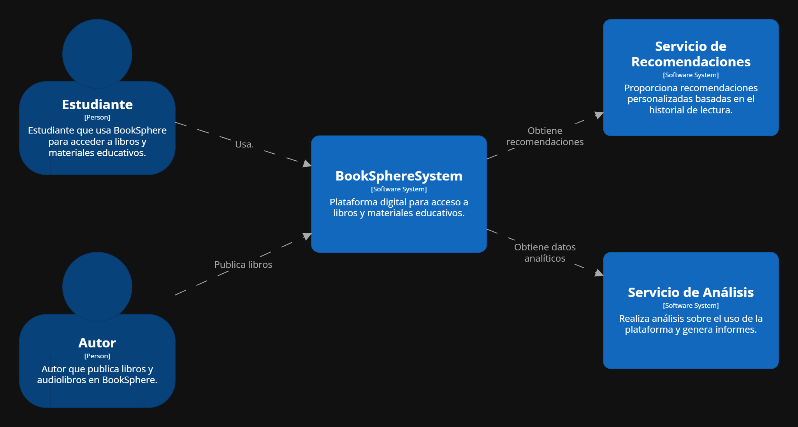
### 4.6.2. Software Architecture Container Diagrams
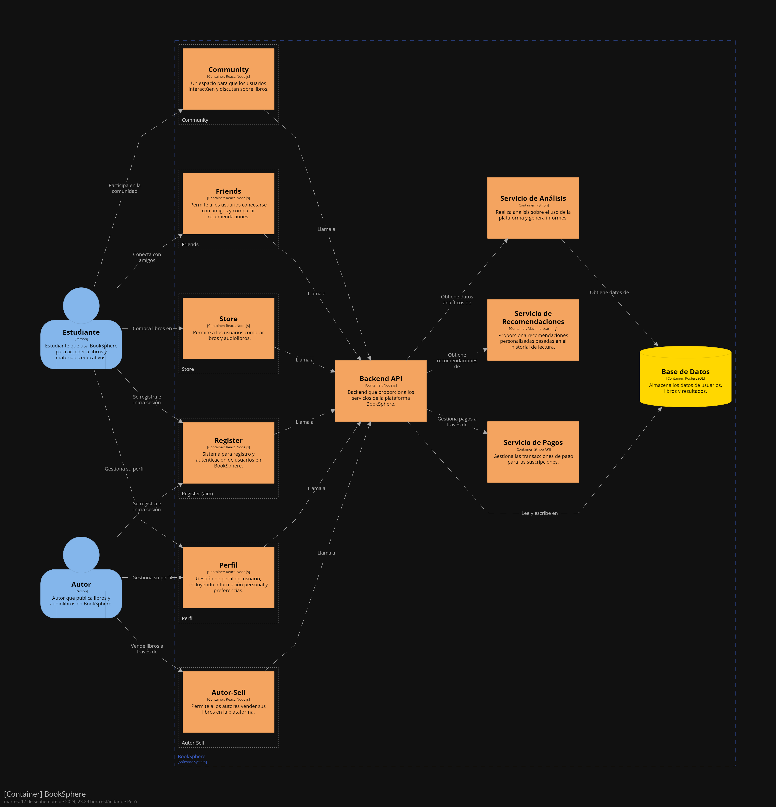
### 4.6.3. Software Architecture Components Diagrams
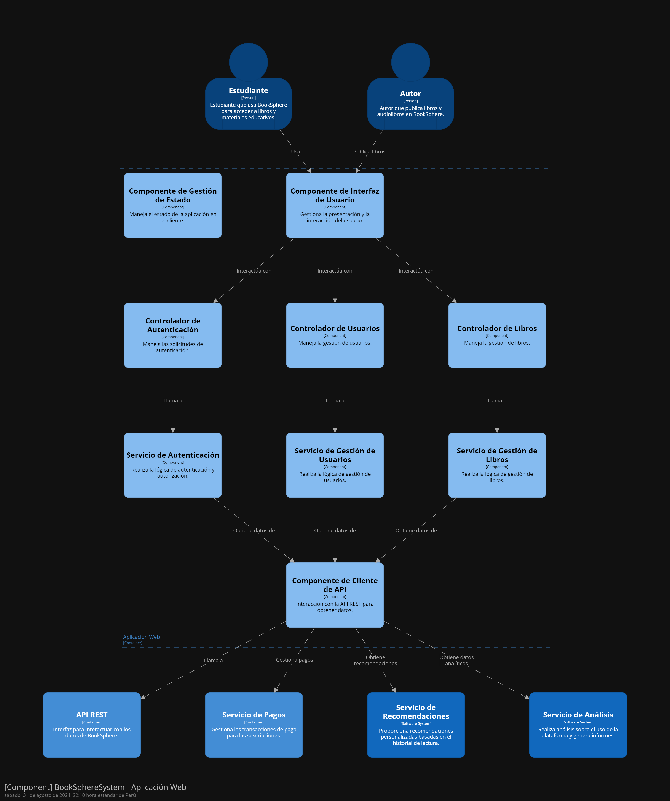
## 4.7. Software Object-Oriented Design
## 4.7.1. Class Diagrams
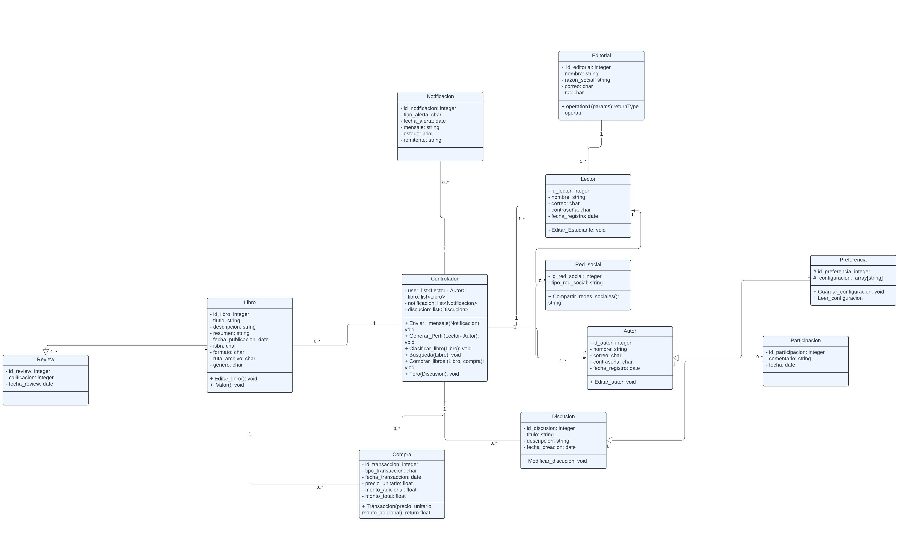 
## 4.7.2. Class Dictionary
| Entidad | Nombre de Atributos | Definición | Tipo de dato | Unidad de Medida | Valores Restringidos |
|---------|---------------------|------------|--------------|------------------|---------------------|
| estudiantes |
| 1 | ID_estudiante | Identificador del estudiante | integer | 2 bytes | Mayor a Cero |
| 2 | nombre | Nombre del estudiante | varchar | Cadena de caracteres | Permite solo caracteres o letras (max. 250) |
| 3 | apellido | Apellido del estudiante | varchar | Cadena de caracteres | Permite solo caracteres o letras (max. 250)|
| 4 | correo | Correo electrónico del estudiante | varchar | Cadena de caracteres | Permite solo caracteres o letras (max. 250) |
| 5 | contrasena | Contraseña del estudiante | varchar | Cadena de caracteres | Permite solo caracteres o letras (max. 250)|
| 6 | fecha_de_registro | Fecha de registro del estudiante | datetime | Fecha y hora | Permite solo fechas y horas |
| 7 | foto_perfil | Foto de perfil del estudiante |  blob | Objetos binarios grandes | Permite archivos multimedia |
| redes_sociales |
| 1 | ID_redes_sociales | Identificador de la red social | integer | 2 bytes | Mayor a cero |
| 2 | tipo_red_social | Tipo de red social | varchar | Cadena de caracteres | Permite solo caracteres o letras (max. 250) |
| autores |
| 1 | ID_autor | Identificador del autor | integer | 2 bytes | Mayor a cero |
| 2 | identificador_unico | Código de barras ISBN del libro | varchar | Cadena de caracteres | Permite solo caracteres o letras (max. 250) |
| 3 | nombre | Nombre del autor | varchar | Cadena de caracteres | Permite solo caracteres o letras (max. 250) |
| 4 | apellido | Apellido del autor | varchar | Cadena de caracteres | Permite solo caracteres o letras (max. 250) |
| 5 | correo | Correo electrónico del autor | varchar | Cadena de caracteres | Permite solo caracteres o letras (max. 250) |
| 6 | contrasena | Contraseña del autor | varchar | Cadena de caracteres | Permite solo caracteres o letras (max. 250) |
| 7 | fecha_registro | Fecha de registro del autor | datetime | Fecha y hora | Permite solo fechas y horas |
| 8 | foto_perfil | Foto de perfil del autor |  blob | Objetos binarios grandes | Permite archivos multimedia |
| editorial_autor |
| 1 | ID_editorial | Identificador de la editorial a la que pertenece el autor | integer | 2 bytes | Mayor a cero |
| 2 | descripcion | Descripción del libro | text | Caracteres de texto | Permite archivos de texto |
| resenias |
| 1 | ID_resenias | Identificador de la reseña | integer | 2 bytes | Mayor a cero |
| 2 | calificacion | Calificación realizada por el usuario | integer | 1 byte | Mayor a cero y menor o igual a 5 |
| 3 | fecha_resenia | Fecha de publicación de la reseña | datetime | Fecha y hora | Permite solo fechas y horas |
| editorial |
| 1 | ID_editorial | Identificador de la editorial | integer | 2 bytes | Mayor a cero |
| 2 | nombre | Nombre de la editorial | varchar | Cadena de caracteres | Permite solo caracteres o letras (max. 250) |
| 3 | razon_social | Razón social de la editorial | varchar | Cadena de caracteres | Permite solo caracteres o letras (max. 250) |
| 4 | correo | Correo electrónico de la editorial | varchar | Cadena de caracteres | Permite solo caracteres o letras (max. 250) |
| 5 | ruc | RUC de la editorial | varchar | Cadena de caracteres | Permite solo caracteres o letras (max. 250) |
| discusiones |
| 1 | ID_discusion | Identificador de la discusión dentro de la plataforma | integer | 2 bytes | Mayor a cero |
| 2 | titulo | Título de la discusión | varchar | Cadena de caracteres | Permite solo caracteres o letras (max. 250) |
| 3 | descripcion | Descripción de la discusión | varchar | Cadena de caracteres | Permite solo caracteres o letras (max. 250) |
| 4 | fecha_creacion | Fecha de creación de la discusión | datetime | Fecha y hora | Permite solo fechas y horas |
| participacion_discusiones |
| 1 | ID_participacion_discusion | Identificador del participante en la discusión | integer | 2 bytes | Mayor a cero |
| 2 | texto | Texto de la participación en la discusión | text | Caracteres de texto | Permite archivos de texto |
| 3 | fecha_participacion | Fecha de participación del usuario en la discusión | datetime | Fecha y hora | Permite fechas y horas |
| 4 | numero_participante | Numero de participante en la discusión | integer | 2 bytes | Mayor a cero |
| comentarios |
| 1 | ID_comentario | Identificador del comentario realizado por un usuario | integer | 2 bytes | Mayor a cero |
| 2 | comentario | Comentario del usuario | text | Caracteres de texto | Permite archivos de texto |
| 3 | fecha_comentario | Fecha de publicación del comentario realizado por un usuario | datetime | Fecha y hora | Permite solo fechas y horas |
| compras |
| 1 | ID_transaccion | Transacción por compra del usuario | integer | 2 bytes | Mayor a cero |
| 2 | tipo_transaccion | Tipo de transacción | varchar | Cadena de caracteres | Permite solo caracteres o letras (max. 250) |
| 3 | fecha_transaccion | Fecha de la transacción realizada | datetime | Fecha y hora | Permite solo fechas y horas |
| 4 | monto | Monto de la transacción | decimal | Números decimales | Permite hasta 29 dígitos significativos |
| configuracion_contenido |
| 1 | ID_configuracion_contenido | Identificador de configuración del contenido | integer | 2 bytes | Mayor a cero |
| 2 | preferencia | Preferencia de confugiración del usuario | varchar | Cadena de caracteres | Permite solo caracteres o letras (max. 250) |
| libros |
| 1 | ID_libro | Identificador del libro | integer | 2 bytes | Mayor a cero |
| 2 | titulo | Título del libro | varchar | Cadena de caracteres | Permite solo caracteres o letras (max. 250) |
| 3 | descripcion | Descripción del libro | varchar | Cadena de caracteres | Permite solo caracteres o letras (max. 250) |
| 4 | resumen | Resumen del libro | varchar | Cadena de caracteres | Permite solo caracteres o letras (max. 1000) |
| 5 | fecha_publicacion | Fecha de publicación del libro | datetime | Fecha y hora | Permite solo fechas y horas |
| 6 | isbn | Identificador internacional único para libros | varchar | Cadena de caracteres | Permite solo caracteres o letras (max. 250) |
| 7 | formato | Forma y dimensiones del libro | varchar | Cadena de caracteres | Permite solo caracteres o letras (max. 250) |
| 8 | ruta_archivo | Directorio donde se encuentra el libro | varchar | Cadena de caracteres | Permite solo caracteres o letras (max. 250) |
| 9 | portada | Portada del libro | blob | Objetos binarios grandes | Permite archivos multimedia |
| notificaciones |
| 1 | ID_notificacion| Identificador de la notificación | integer | 2 bytes | Mayor a cero |
| 2 | tipo_alerta | Tipo de notificación | varchar | Cadena de caracteres | Permite solo caracteres o letras (max. 250) |
| 3 | fecha_alerta | Fecha y hora de envió de la notificación | datetime | Fecha y hora | Permite solo fechas y horas |
| 4 | mensaje | Mensaje de la notificación | text | Caracteres de texto | Permite archivos de texto |
| 5 | estado | Estado de la notificación (leído o no leído) | varchar | Cadena de caracteres | Permite solo caracteres o letras (max. 250) |
| generos |
| 1 | ID_genero | Identificador de género literario | integer | 2 bytes | Mayor a cero |
| 2 | nombre | Nombre de género literario | varchar | Cadena de caracteres | Permite solo caracteres o letras (max. 250) |
| libros_generos |
| 1 | ID_libros_genero | Identificador de género del libro | integer | 2 bytes | Mayor a cero |

## 4.8. Database Design
## 4.8.1. Database Diagram

### CAPÍTULO V: Product Implementation, Validation & Deployment
## 5.1. Software Configuration Management
En nuestro proyecto, el Software Configuration Management (SCM) se gestiona a través de GitHub, que sirve como nuestro repositorio remoto y plataforma de control de versiones. Utilizamos un flujo de trabajo basado en ramas para organizar el desarrollo, con ramas dedicadas para características, correcciones y producción, lo que asegura una integración ordenada y eficiente. Los mensajes de commit siguen un formato estandarizado para mantener un historial claro, y las integraciones se realizan mediante pull requests revisadas por el equipo. Además, empleamos GitHub Actions para la integración continua, que automatiza pruebas y validaciones, garantizando que los cambios sean revisados y aprobados antes de su fusión.
### 5.1.1. Software Development Environment Configuration

En esta sección, se definen las herramientas utilizadas en cada fase del desarrollo del software:

| **Herramienta**                | **Propósito**                                                                                             | **Ruta de Descarga/Referencia**                    |
|--------------------------------|-----------------------------------------------------------------------------------------------------------|----------------------------------------------------|
| **GitHub**                     | Control de versiones y colaboración en el código fuente del proyecto.                                      | [GitHub](https://github.com)                      |
| **Figma**                      | Diseño de interfaces y elaboración de prototipos interactivos.                                              | [Figma](https://www.figma.com)                     |
| **Visual Studio Code**         | Entorno de desarrollo para la codificación y edición de archivos.                                           | [Visual Studio Code](https://code.visualstudio.com)|
| **HTML5**                      | Lenguaje de marcado para la elaboración de páginas web.                                                     | [HTML5](https://developer.mozilla.org/en-US/docs/Web/HTML)|
| **CSS3**                       | Tecnología para dar estilo a las páginas web, permitiendo el diseño visual.                                 | [CSS3](https://developer.mozilla.org/en-US/docs/Web/CSS)|
| **JavaScript**                 | Lenguaje de programación orientado a objetos utilizado para implementar funcionalidades en la Landing Page. | [JavaScript](https://developer.mozilla.org/en-US/docs/Web/JavaScript)|
| **Angular CLI**                | Herramienta de línea de comandos para crear, desarrollar y mantener aplicaciones Angular.                   | [Angular CLI](https://angular.io/cli)              |
| **GitHub Pages**               | Plataforma que facilita el despliegue sencillo de páginas web directamente desde repositorios de GitHub.    | [GitHub Pages](https://pages.github.com)          |
| **Markdown**                   | Documentación técnica y de usuario, utilizando un formato de texto sencillo fácil de convertir en HTML.     | [Markdown Guide](https://www.markdownguide.org)   |

### 5.1.2. Source Code Management

#### Repositorio de la Landing Page
**Implementación de GitFlow:** Para nuestra estrategia de gestión de versiones con Git, nos hemos inspirado en el artículo *"A successful Git branching model"* de Vincent Driessen, adoptando el modelo de ramificación GitFlow. Este enfoque nos permite establecer claramente las convenciones de ramificación que aplicamos en nuestro proyecto.
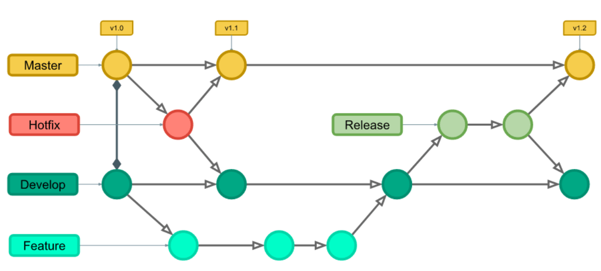
- **Rama Principal (Main branch):** Contiene el código en producción y se conoce como la Master branch o Main branch.
  - **Notación:** `main`

- **Rama de Desarrollo (Develop branch):** Acumula las últimas actualizaciones y cambios para la próxima versión. Funciona como un entorno de integración y prueba continua.
  - **Notación:** `develop`

- **Rama de Lanzamiento (Release branch):** Facilita la preparación de una nueva versión del producto, permitiendo correcciones de errores y recibiendo más actualizaciones de `develop`.
  - **Debe derivarse de:** `develop`
  - **Debe fusionarse con:** `develop` y `master/main`
  - **Notación:** `release`

- **Rama de Características (Feature branch):** Se utiliza para desarrollar nuevas funcionalidades para la siguiente versión o futuras iteraciones.
  - **Debe derivarse de:** `develop`
  - **Debe fusionarse de vuelta a:** `develop`
  - **Notación:** `feature`

- **Rama de Corrección Rápida (Hotfix branch):** Aborda errores críticos en producción, permitiendo la implementación rápida de soluciones.
  - **Debe derivarse de:** `master/main`
  - **Debe fusionarse con:** `develop` y `master/main`
  - **Notación:** `hotfix`

**Conventional Commits**

Implementaremos **Conventional Commits** para registrar los cambios en el repositorio de manera clara. Utilizaremos palabras clave como `fix` para correcciones y `feature` para nuevas funcionalidades.

**Versionamiento del Software**

El versionamiento del software se gestionará mediante etiquetas en Git (`git tag`). La convención para las etiquetas es `vX.Y.Z`:

- **X**: Versión principal, se incrementa cuando se realizan cambios significativos en la funcionalidad del software que podrían afectar su estructura.
- **Y**: Versión secundaria, se ajusta para la adición o eliminación de características sin modificar la estructura principal del software.
- **Z**: Versión de parche, se usa para pequeñas correcciones y mejoras que no afectan la funcionalidad principal.

Por ejemplo, las versiones podrían ser `v1.2.0` o `v1.2.3`, reflejando los avances y actualizaciones del proyecto.

### 5.1.3. Source Code Style Guide & Conventions

Esta sección detalla las directrices para la programación y la documentación del proyecto.

- **Idioma de Codificación**: Todo el código, documentación técnica y especificaciones se escribirán en inglés para asegurar consistencia y claridad.
- **Herramientas Utilizadas**: El proyecto se desarrolla utilizando **GitHub** para control de versiones, **GitFlow** para la gestión de ramas, y **Visual Studio Code** como editor de código. Para el diseño y planificación, usamos **Figma** **Miro**.
- **Tecnologías**: La **Landing Page** se construye utilizando **HTML**, **CSS**, y **JavaScript** para asegurar una interfaz moderna y funcional.

### 5.1.4. Software Deployment Configuration
En esta sección se explicará el proceso del despliegue del proyecto.
1.- El primer paso es crear un repositorio en GitHub donde almacenaremos el código de nuestra landing page.

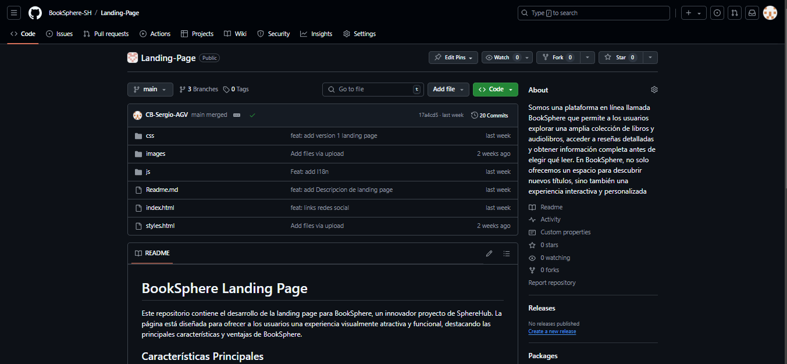

2.- Habilitamos GithubPages en la siguiente rama:

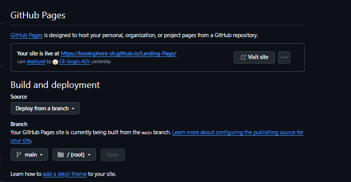

3.- Luego se confirma el dezpliegue de la página.

[Landing Page](https://booksphere-sh.github.io/Landing-Page/)  

## 5.2. Landing Page, Services & Applications Implementation

### 5.2.1. Sprint 1

Durante el Sprint 1, nuestro enfoque principal fue el desarrollo de la landing page para el proyecto BookSphere. Este sprint fue fundamental para diseñar y construir la interfaz inicial que los usuarios verán al acceder a la plataforma. La tarea incluyó asegurar que la página de inicio cumpla con los requisitos de diseño moderno y funcionalidad necesarios para captar la atención de los usuarios y proporcionar una primera impresión efectiva.

#### 5.2.1.1. Sprint Planning 1

| **Sprint #**                        | 1                                                                                              |
|-------------------------------------|------------------------------------------------------------------------------------------------|
| **Date**                           | 2024-09-01                                                                                   |
| **Time**                           | 9:00 PM                                                                                      |
| **Location**                       | Salas virtuales (Meet)                                                                        |
| **Prepared By**                    | Sergio André Gómez Vallejos                                                                  |
| **Attendees (to planning meeting)**| Gómez Vallejos Sergio André - U20221D401 Salon Puerta Merly - U20201B772 Romero Qwistgaard, Russell Stephen - U20211043 Nanfuñay Liza, Pedro Jesús - U202215462 Fabian Puente, Ronaldo Macedonio - U20201B193 |
| **Sprint 1 Review Summary**        | En este sprint, nos enfocamos en el desarrollo y diseño de la landing page para el proyecto BookSphere. Se completaron todas las funcionalidades básicas necesarias para la presentación inicial de la plataforma. |
| **Sprint 1 Retrospective Summary** | Se realizó una revisión exhaustiva de la landing page para garantizar que cumpliera con los estándares de calidad y proporcionara una experiencia óptima para los visitantes. Se identificaron áreas de mejora y se ajustaron según los comentarios recibidos. |
| **Sprint 1 Goal**                  | Our focus is on developing the functionality of the landing page with internationalization (i18n). We believe it delivers a functional and user-friendly experience to the users. This will be confirmed when all user stories related to the landing page are implemented and reviewed based on the target segments’ feedback. |
| **Sprint 1 Velocity**              | Se estableció un Velocity de 20 Story Points para este Sprint. |
| **Sum of Story Points**            | 20 Story Points |

#### 5.2.1.2. Sprint Backlog 1

**Objetivo del Sprint:** El objetivo principal del Sprint 1 fue desarrollar las funcionalidades básicas de la landing page, asegurando que se incluya la internacionalización y se implementen las secciones necesarias para la presentación efectiva del proyecto BookSphere.

**Sprint Backlog:**

| **Id**  | **Title**                                | **Work-Item / Task**                        | **Estimation** | **Assigned To**               | **Status (To-do/In-Process/To-Review/Done)** |
|---------|------------------------------------------|---------------------------------------------|----------------|-------------------------------|---------------------------------------------|
| US001   | Acceso a la sección de Nosotros          | Implementar acceso a la sección de Nosotros | 4              | Gómez Vallejos Sergio André   | Done                                        |
| US002   | Incluir Internacionalización (i18n)      | Implementar el cambio de idioma             | 5              | Gómez Vallejos Sergio André   | Done                                        |
| US003   | Acceso a la sección de Características   | Implementar acceso a la sección de Características | 2          | Gómez Vallejos Sergio André   | Done                                        |
| US004   | Sector de tipo de usuarios disponibles   | Implementar sector de usuarios disponibles  | 3              | Gómez Vallejos Sergio André   | Done                                        |
| US005   | Sector sección de comentarios            | Implementar sección de comentarios          | 4              | Gómez Vallejos Sergio André   | Done                                        |
| US006   | Acceso a la sección de Cómo Funciona     | Crear sector de Cómo Funciona               | 3              | Gómez Vallejos Sergio André   | Done                                        |

#### 5.2.1.3. Development Evidence for Sprint Review
| **Repository** | **Branch** | **Commit Id**       | **Commit Message**        | **Commit Message Body** | **Committed on (Date)** |
|----------------|------------|---------------------|---------------------------|-------------------------|-------------------------|
| Landing-Page   | main       | fdae17d6fa1837edcf097a8c3cf7873a03f28c4b | feat: Add version 1 landing page     | Se añade la primera versión del landing page | 31/08/2024              |
| Landing-Page   | main       | 958f7dbaa8616ebaa7b6e2f27a8eeeae16e59b58 | feat: Add carpetas y actualizar      | Se añade nuevas carpetas y actualización del código| 31/08/2024              |
| Landing-Page   | developer       | 1e5194a7f2cd18e9228b335f8bd419f5b9310d8e | feat: Add I18n     | Se implementa el cambio de idioma de español a ingles y viceversa en el landing page         | 08/09/2024              |
| Landing-Page   | developer       | 6eb7396a032bfb83bdad5f1653e2c4369fade584 | feat: update links de la landing page       |  Se le dio destino a los botones de redes sociales | 08/09/2024              |

[Link del repositorio](https://github.com/BookSphere-SH/Landing-Page/commits/developer/)
#### 5.2.1.4. Testing Suite Evidence for Sprint Review

Durante este sprint, se realizaron varias pruebas para asegurar que las funcionalidades de la landing page se implementaran correctamente. A continuación, se detallan los commits relevantes que reflejan las pruebas realizadas:

| **Repository**                           | **Branch**            | **Commit Id**                            | **Commit Message** | **Commit Message Body**      | **Committed on (Date)** |
|-----------------------------------------|-----------------------|------------------------------------------|--------------------|------------------------------|-------------------------|
| grupo02-BookSphere-testing               | tb1-Sergio-Gómez      | f000f1ae28314757a922164341a6eea61cde49d9 | ADD feature        | Se añade el acceso a la sección de Nosotros                            | 09/08/2024              |
| grupo02-BookSphere-testing              | tb1-Sergio-Gómez      | cc037a256c90ddcd78b9c7b32d36fae39b5b9c02 | ADD feature        | Se incluye Internacionalización   (i18n)                    | 09/09/2024              |
| grupo02-BookSphere-testing              | tb1-Sergio-Gómez      | ea544e2a27c9ff41e9d5bf1be096fa3d6810c498 | ADD feature        | Se  añade acceso a la sección de Características                           | 09/09/2024              |
| grupo02-BookSphere-testing              | tb1-Sergio-Gómez      | ad569337c6d5eba7613eb548cd740a89550057a1 | ADD feature        | Se añade el Sector de tipo de usuarios disponibles                           | 09/09/2024              |
| grupo02-BookSphere-testing              | tb1-Sergio-Gómez      | ca0af90e56478b8f6473b98e329dc2cb3ed81d7e | ADD feature        | Se añade el Sector sección de comentarios                            | 09/09/2024              |
| grupo02-BookSphere-testing              | tb1-Sergio-Gómez      | ab9ebf79211dd5e97c3094a121becd816d8617db | ADD feature        | Se añade el Acceso a la sección de Cómo Funciona                            | 09/09/2024              |

[Link del repositorio Commints](https://github.com/BookSphere-SH/grupo02-BookSphere-testing/commits/tb1-Sergio-G%C3%B3mez/)  

#### 5.2.1.5. Execution Evidence for Sprint Review

Durante el primer sprint, se lograron varios hitos importantes en el desarrollo de la landing page para BookSphere. A continuación, se presenta un resumen de los logros alcanzados:

- **Establecimiento de Repositorios**: Se crearon y configuraron múltiples repositorios en GitHub para gestionar el código y las pruebas.

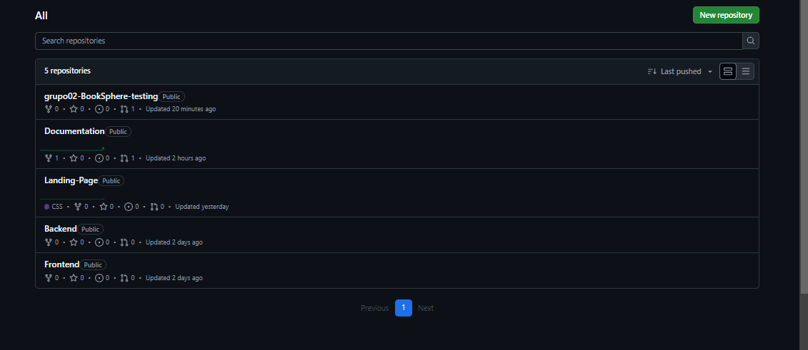

- **Implementación del Landing Page**: Se diseñó y desarrolló la página de inicio de BookSphere, implementando funcionalidades clave y asegurando que cumpla con los requisitos del proyecto.

  

- **Imágenes del Landing Page**:
  - **Inicio**: 
  - **Sección Nosotros**: 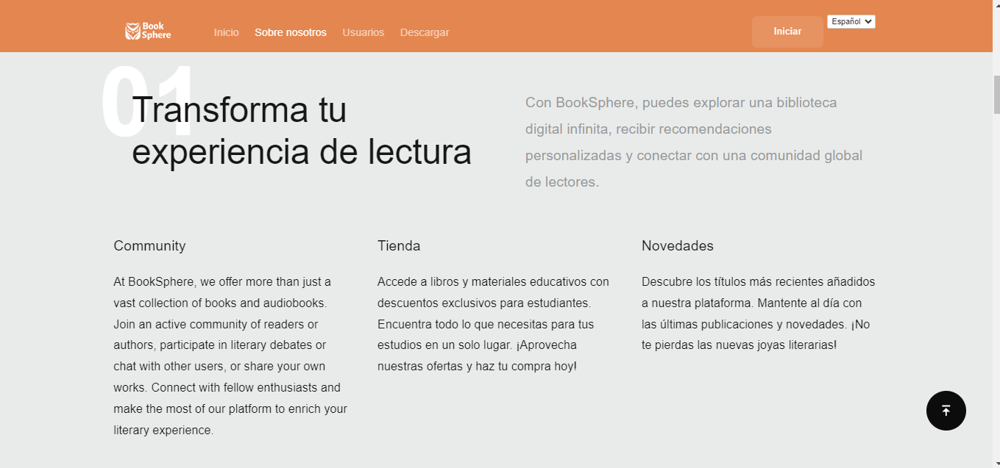
  - **Cómo Funciona la Aplicación**: 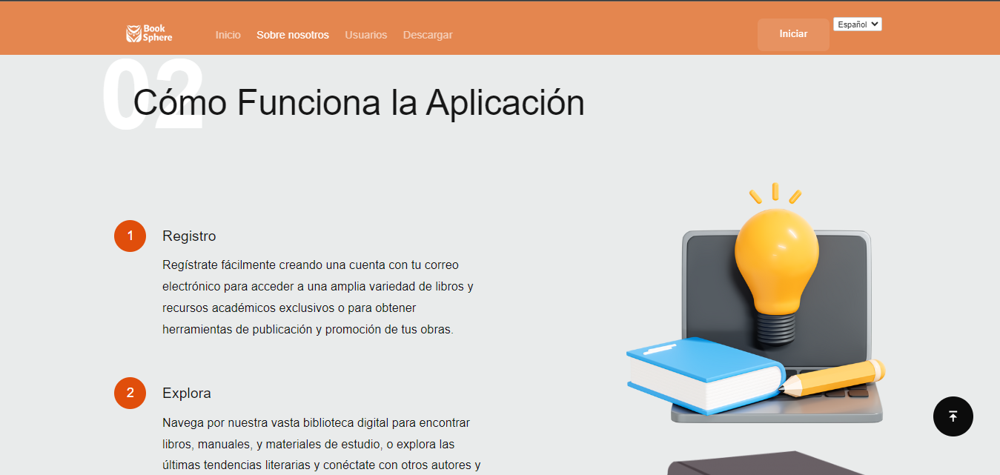
  - **Las Mejores Características de BookSphere**: 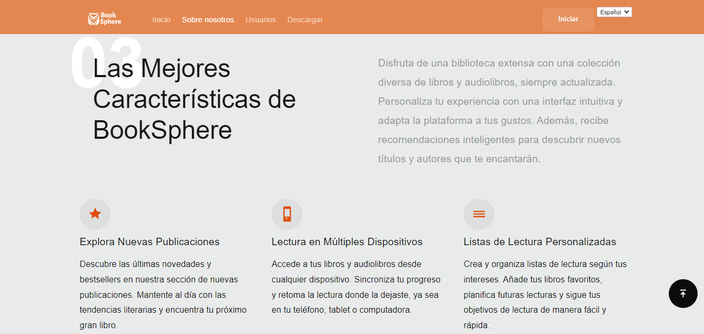
  - **Lo Que Dicen Nuestros Usuarios**: 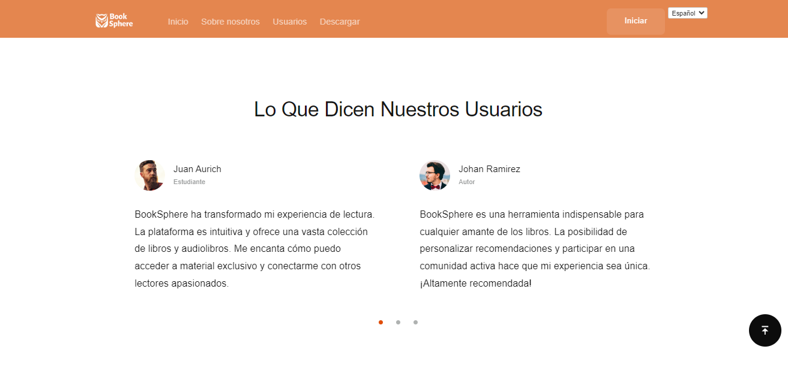
  - **Sección de Cambio de Idioma**: 

Estos logros reflejan el avance significativo en la creación de una experiencia de usuario atractiva y funcional para BookSphere.

  
#### 5.2.1.6. Services Documentation Evidence for Sprint Review

Durante el primer sprint, se logró lo siguiente en relación con la documentación y despliegue de la landing page:

**Documentación del Código para Despliegue:**

La documentación del código para el despliegue de la landing page incluye los archivos y configuraciones necesarios para implementar la página en el entorno de producción. A continuación, se presenta la documentación relevante:

- **Documentación del Código para Despliegue:**

  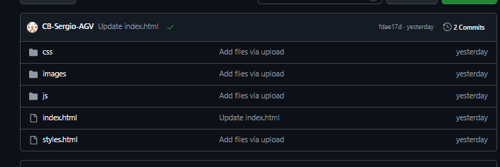
  
  Esta imagen muestra la estructura y organización de los archivos necesarios para el despliegue de la landing page. Incluye los archivos principales y sus ubicaciones dentro del proyecto.

- **Documentación de `index.html`:**

  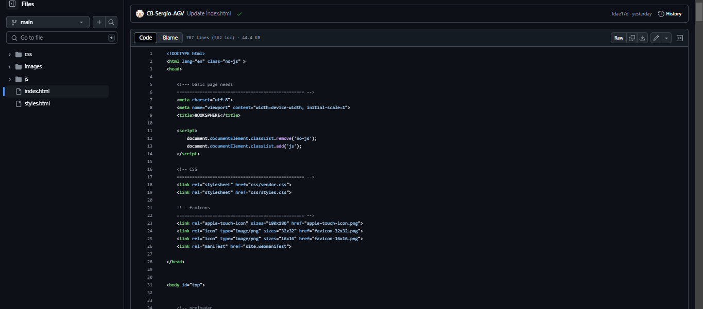
  
  Aquí se proporciona una vista del archivo `index.html`, que es la base de la landing page. Este archivo contiene el código HTML que define la estructura y el contenido de la página inicial.

**Resumen:**

En este sprint, la documentación se centró en asegurar que todos los elementos necesarios para el despliegue de la landing page estuvieran correctamente organizados y documentados. Esto garantiza que la implementación de la página en el entorno de producción sea efectiva y que el equipo pueda replicar el proceso si es necesario.

Este enfoque ayuda a mantener la coherencia en la implementación y proporciona una guía clara para futuros desarrollos y despliegues.

#### 5.2.1.7. Software Deployment Evidence for Sprint Review

Durante este Sprint, se realizaron las siguientes actividades en relación con el despliegue de los productos del proyecto, incluyendo la Landing Page y otras aplicaciones web.

### Introducción
Durante este Sprint, se llevaron a cabo las siguientes actividades clave relacionadas con el despliegue:

1. **Creación de Repositorios y Configuración en GitHub:**
   - Se crearon repositorios en GitHub para gestionar el código fuente y el seguimiento de cambios. Estos repositorios incluyeron la **Landing Page** y otros componentes del proyecto.
   - Se configuraron los repositorios para permitir el despliegue de la Landing Page.

2. **Configuración del Proceso de Despliegue:**
   - **GitHub Pages:** Se configuró GitHub Pages para el despliegue de la Landing Page. Este servicio proporciona una manera sencilla de alojar el sitio web directamente desde un repositorio de GitHub.

### Proceso de Despliegue
A continuación se detallan los pasos realizados durante el Sprint para el despliegue:

1. **Despliegue en GitHub Pages:**
   - Se subió el código de la Landing Page al repositorio en GitHub.
   - Se configuró GitHub Pages en el repositorio para publicar el contenido en la web. El proceso incluyó la configuración del dominio y la personalización de la página de inicio. 
   
   

2. **Verificación del Despliegue:**
   - Se realizó una revisión exhaustiva del sitio web publicado en GitHub Pages para asegurar que todos los elementos de la Landing Page funcionaran correctamente.
   - Se realizaron pruebas de funcionalidad para verificar que el sitio se cargara correctamente y que no hubiera errores en el contenido desplegado.
   
   

El proceso de despliegue durante este Sprint ha permitido establecer una base sólida para la gestión y publicación del proyecto. La configuración de GitHub Pages ha optimizado el proceso de despliegue y garantizado una integración continua efectiva, facilitando el despliegue y la actualización del sitio web.

#### 5.2.1.8. Team Collaboration Insights during Sprint  
Durante este Sprint, el equipo ha trabajado de manera colaborativa por 1 alumno en el diseño y programacion en la implementación de la Landing Page de Book Sphere. A continuación, se presenta un resumen de cómo se han desarrollado las actividades de implementación, junto con capturas de pantalla de los analíticos de colaboración y commits en GitHub realizados por los miembros del equipo.

**Actividades de Implementación**
El equipo ha dividido las tareas de implementación de la Landing Page en varias actividades clave, asegurando que todos los miembros del equipo participen activamente en el desarrollo. Las actividades incluyen:

- Diseño y maquetación de la Landing Page.
- Implementación de secciones clave como el encabezado, pie de página, y contenido principal.
- Configuración de la integración continua y despliegue en Netlify.
- Pruebas y ajustes finales para asegurar la calidad del producto.
**Analíticos de Colaboración**
A continuación, se presentan capturas de pantalla de los analíticos de colaboración en GitHub, mostrando la participación de cada miembro del equipo en términos de commits y contribuciones.

**Captura de Analíticos de Colaboración en GitHub**
-En el repositorio de la Landing Page

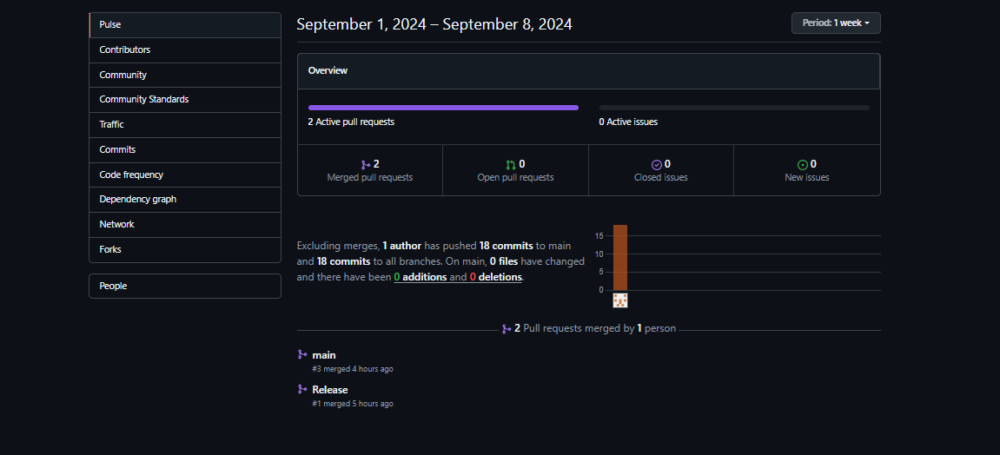
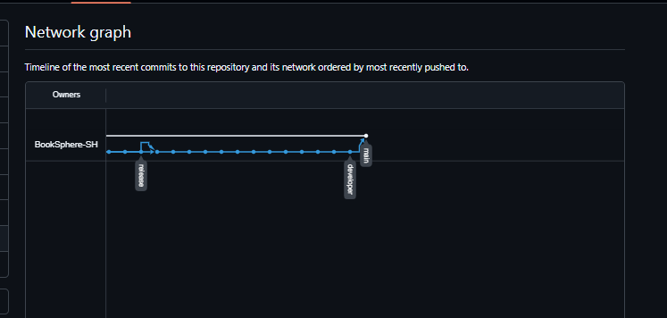
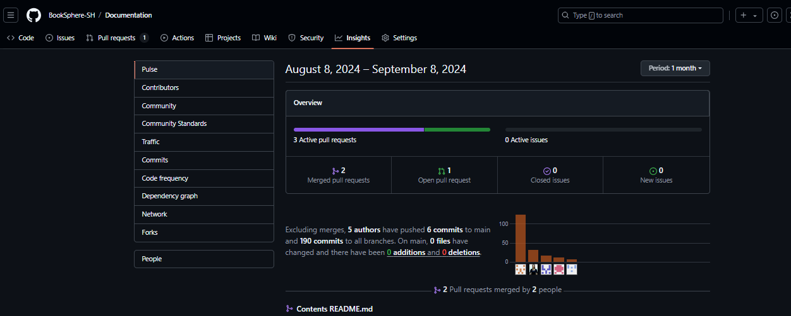
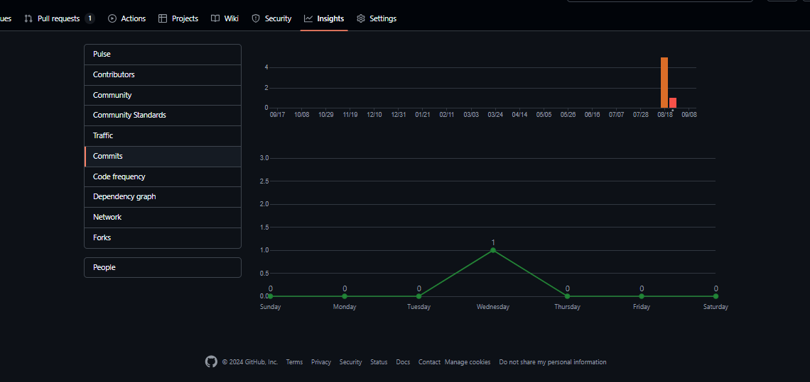
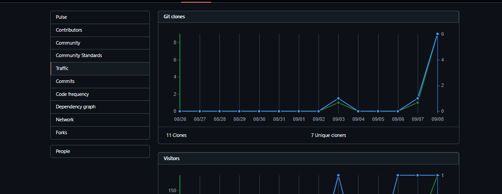
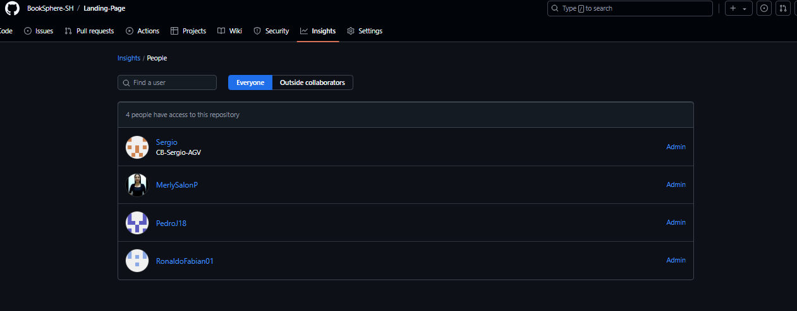

## Video About-the-Product
En esta sección se presentará un video explicativo sobre la landing page de BookSphere, donde se destacarán sus principales características y funcionalidades. El video guiará a los usuarios a través de las secciones clave, como la biblioteca digital, los planes de suscripción y las opciones personalizadas, mostrando cómo la plataforma facilita el acceso a libros y audiolibros de manera sencilla y atractiva. 

Video acerca del Landing Page: https://upcedupe-my.sharepoint.com/:v:/g/personal/u20221d401_upc_edu_pe/EZyAnwC2REVAu0bTvnx05TgBoyTQdTk6m7ZSoHa1Hlz9_Q?e=jMinTq&nav=eyJyZWZlcnJhbEluZm8iOnsicmVmZXJyYWxBcHAiOiJTdHJlYW1XZWJBcHAiLCJyZWZlcnJhbFZpZXciOiJTaGFyZURpYWxvZy1MaW5rIiwicmVmZXJyYWxBcHBQbGF0Zm9ybSI6IldlYiIsInJlZmVycmFsTW9kZSI6InZpZXcifX0%3D
## Conclusiones

1. **Implementación Efectiva:** La landing page de BookSphere ha sido desarrollada con un enfoque en la experiencia del usuario, utilizando tecnologías modernas como HTML, CSS y JavaScript. La implementación del carrusel de imágenes y texto, junto con la sección de funcionalidades y planes disponibles, proporciona una interfaz intuitiva y atractiva.

2. **Diseño Responsivo:** Se logró un diseño responsivo que garantiza una experiencia de usuario consistente tanto en dispositivos móviles como en escritorios. Esto es crucial para mantener la accesibilidad y la usabilidad de la página en diferentes plataformas.

3. **Interactividad y Funcionalidad:** La inclusión de secciones interactivas y funcionales, como las preguntas frecuentes y el resumen de la plataforma, facilita la navegación y la obtención de información relevante para los usuarios. La integración de estos elementos ayuda a destacar los beneficios de BookSphere de manera clara y eficaz.

4. **Optimización y Pruebas:** Las pruebas realizadas confirmaron la efectividad de la landing page en términos de funcionalidad y diseño. Los ajustes finales permitieron optimizar el rendimiento y asegurar que todas las características funcionaran según lo esperado.

5. **Futuras Mejoras:** Aunque la landing page cumple con los requisitos iniciales, se pueden considerar futuras mejoras como la adición de más secciones interactivas, la integración de análisis de usuario y la implementación de características avanzadas para mejorar aún más la experiencia del usuario.

## Bibliografía
1. The C4 model for visualising software architecture (2024) Recuperado de: https://c4model.com

## Anexos

**Enlaces**

 |Segmento del trabajo|Link de repositorio|
|---------|---------|
| LandingPage (Anexo A)    | https://booksphere-sh.github.io/Landing-Page/ |
| Video de entrevista (Anexo B)   | https://upcedupe-my.sharepoint.com/:v:/g/personal/u20221d401_upc_edu_pe/ESGj4Ty30YpFnIJPoXcsOEoBkjgUeDwJY9UioIDpVb5NIg?e=NrI3gY&nav=eyJyZWZlcnJhbEluZm8iOnsicmVmZXJyYWxBcHAiOiJTdHJlYW1XZWJBcHAiLCJyZWZlcnJhbFZpZXciOiJTaGFyZURpYWxvZy1MaW5rIiwicmVmZXJyYWxBcHBQbGF0Zm9ybSI6IldlYiIsInJlZmVycmFsTW9kZSI6InZpZXcifX0%3D  |
